# unfirehose

A local-first dashboard for Claude Code power users. Reads your `~/.claude/` session data, normalizes it into SQLite, and gives you a single pane of glass across every project, every agent, every token.

No cloud. No telemetry. Your data stays on your machine.

## Why

Claude Code writes session logs to `~/.claude/projects/` as JSONL files. If you run multiple projects and agents, that directory grows fast — 3GB+, hundreds of sessions, tens of thousands of messages. There's no built-in way to:

- See which project is burning the most tokens right now
- Track equivalent API cost on a Max plan
- Watch agent activity in real time across all projects
- Explore thinking blocks and tool call patterns
- Correlate prompts with git commits
- Get alerted when usage spikes

This tool does all of that.

## Screenshots

See [gallery below](#gallery).

## Features

### Dashboard
Time-range filtered overview (1h to 28d) with:
- Session, message, model, and cost summary cards
- Daily activity chart
- Hour-of-day distribution with automatic sleep detection (bell curve centers on your active hours)
- Day-of-week activity breakdown
- Day x Hour hotspot overlay — see exactly when your agents run hottest
- Model usage donut with per-model cost breakdown
- Dual UTC/local time display on all hour axes

### Active Sessions
Shows currently running agent sessions with real-time status, project context, and quick actions.

### Live Tailing
SSE-powered real-time view of active sessions. Watch your agents work as they stream responses, make tool calls, and think. Doom-scrollable feed design.

### Usage Monitor
Operational monitoring with:
- Per-minute token timeline (auto-buckets: minute/hour/day based on window)
- Per-project usage breakdown with stacked bars
- Agent Standup — 30-day activity summary per project with recent prompts
- Prompts correlated with git commits (green badge = committed, yellow = uncommitted, orange = unpushed)
- Configurable alert thresholds (per-minute, 5min, 15min, hourly windows)
- Alert history with drill-down detail pages

### Projects
- Project cards with session count, message volume, and 30-day cost
- Expandable project detail with git info, remotes, recent commits, CLAUDE.md preview
- Commit SHAs linked to all upstream remotes (supports multi-remote mirrors across Gitea, GitHub, GitLab)
- Per-project session browser with git branch context
- Full session viewer with message timeline, tool calls, thinking blocks, and token usage

### Thinking Explorer
Browse and search thinking blocks across all sessions. See what your agents are actually reasoning about.

### Token Analysis
Deep token breakdown by model with:
- Input, output, cache read, cache write splits
- Per-model equivalent API cost at 2026 rates
- Tool call frequency analysis
- Content block type distribution

### Todos / Kanban
Cross-session todo tracking extracted from all harness JSONL. Drag-and-drop kanban board with particle effects, inline editing, time estimates, and agent boot on card drop. Grouped by project with triage workflow. File attachments via drag-drop upload with image thumbnails.

### Schema Browser
Browse the [unfirehose/1.0](packages/schema/docs/README.md) spec and harness adapter documentation directly in the dashboard. The spec is also published as [`@unturf/unfirehose-schema`](https://www.npmjs.com/package/@unturf/unfirehose-schema) with JSON Schema files and TypeScript types.

### All Logs
Raw JSONL log browser with filtering and search. When you need to see exactly what happened.

### Agent Deployment
Boot Claude Code agents from the UI into tmux sessions. Mega deploy for fleet management — spawn, status, and cull. Auto-cull when all assigned todos complete. UNEOF poison pill detection for agent lifecycle management.

### Permacomputer Mesh
Mesh status view showing compute nodes, per-node resource tracking, and fleet overview.

### Blog / Microblog
Built-in jsonblog.org compatible posting system. Write status updates, link external sources, export as `blah.json`. Pulls profile data from JSON Resume if available.

### Settings
Configure alert thresholds, display preferences, compute settings, and integration settings.

## Packages

This is a Turborepo monorepo. Four packages are published to npm under the [`@unturf`](https://www.npmjs.com/org/unturf) scope:

| Package | npm | Description |
|---------|-----|-------------|
| [`@unturf/unfirehose`](packages/core) | [](https://www.npmjs.com/package/@unturf/unfirehose) | Core data layer — ingestion, SQLite schema, types, PII detection, formatters |
| [`@unturf/unfirehose-schema`](packages/schema) | [](https://www.npmjs.com/package/@unturf/unfirehose-schema) | [unfirehose/1.0](packages/schema/docs/README.md) spec — JSON Schema, TypeScript types, 16 harness adapter docs |
| [`@unturf/unfirehose-router`](packages/router) | [](https://www.npmjs.com/package/@unturf/unfirehose-router) | CLI daemon — watches JSONL and forwards to cloud |
| [`@unturf/unfirehose-ui`](packages/ui) | [](https://www.npmjs.com/package/@unturf/unfirehose-ui) | Shared React components for dashboard UI |

Internal packages (not published):

| Package | Description |
|---------|-------------|
| `@unturf/unfirehose-web` | Next.js 15 dashboard app |
| `@unturf/unfirehose-worker` | Background ingestion service |
| `@unturf/unfirehose-config` | Shared TypeScript configuration |

```
unfirehose/
├── apps/
│   ├── web/         @unturf/unfirehose-web       Next.js dashboard (private)
│   └── worker/      @unturf/unfirehose-worker    Background ingestion (private)
└── packages/
    ├── core/        @unturf/unfirehose            Data layer, types, ingestion
    ├── schema/      @unturf/unfirehose-schema     unfirehose/1.0 spec + JSON Schema
    ├── router/      @unturf/unfirehose-router     CLI daemon
    ├── ui/          @unturf/unfirehose-ui          React components
    └── config/      @unturf/unfirehose-config     TypeScript config (private)
```

## Stack

| Layer | Tech |
|-------|------|
| Framework | Next.js 15 (App Router) |
| Language | TypeScript |
| Styling | Tailwind CSS v4 |
| Database | better-sqlite3 (local, ~250MB normalized from ~3GB JSONL) |
| Charts | Recharts |
| Data fetching | SWR with auto-refresh |
| Real-time | Server-Sent Events (SSE) |
| File watching | `fs.watch` on JSONL files for auto-ingest |
| Monorepo | Turborepo (`apps/web`, `packages/core`, `packages/schema`, `packages/ui`, `packages/config`) |

~22K lines of TypeScript across 165 commits. No external services. No API keys. No Docker. Just `npm install && npm run dev`.

## Quickstart

```bash
git clone https://github.com/russellballestrini/unfirehose-nextjs-logger.git
cd unfirehose
npm install
npm run dev
```

Open [http://localhost:3000](http://localhost:3000).

The first load triggers an ingestion of your `~/.claude/` session data into SQLite at `~/.unfirehose/unfirehose.db`. Subsequent ingestions are incremental (byte offset tracking) and triggered automatically by file watcher on JSONL changes.

### Requirements

- Node.js 18+
- An existing `~/.claude/` directory (you need to have used Claude Code at least once)
- That's it

## Architecture

```
~/.claude/projects/          JSONL session files (source of truth)
~/.fetch/sessions/           Fetch session files
~/.uncloseai/sessions/       uncloseai session files
        │
        ▼
  [file watcher]             fs.watch on active JSONL files
        │
        ▼
  packages/core              @unturf/unfirehose — ingestion, adapters, DB schema, todo extraction
        │
        ▼
  ~/.unfirehose/unfirehose.db   SQLite (normalized: projects → sessions → messages → content_blocks)
        │
        ▼
  apps/web API routes        40+ endpoints serving dashboard, usage, projects, sessions, tokens, alerts, boot, mesh
        │
        ▼
  apps/web frontend          SWR auto-refresh, SSE live tailing, Recharts visualization
```

### Performance

API routes are optimized for parallel execution. Benchmark all pages and routes:

```bash
python3 scripts/perf-report.py --runs 3 --threshold 500
```

Crawls `/sitemap` and all API routes, generates JSON + terminal report. Key patterns:
- **Parallel SSH probes** — mesh node probes run concurrently, 3 SSH calls combined into 1 per node
- **Parallel git operations** — project tree and git info routes run all spawns in `Promise.all`
- **Covering indexes** — `/api/tokens` and `/api/logs` use `EXISTS` subqueries and covering indexes
- **Batch-capped external checks** — `/api/scrobble/preview` caps concurrent forge API checks at 7 projects with 2s timeout

### Database Schema

- **projects** — one row per unique project directory
- **sessions** — one row per session UUID, with git branch snapshot
- **messages** — every JSONL entry (user, assistant, system) with token usage
- **content_blocks** — normalized from message content arrays (text, thinking, tool_use, tool_result)
- **todos** — cross-session task tracking with UUIDv7 identity
- **todo_events** — audit log of todo status changes
- **usage_minutes** — pre-aggregated per-minute token rollups for fast spike detection
- **alerts** — triggered alert log with acknowledgment tracking
- **agent_deployments** — tmux agent session tracking for fleet management
- **project_visibility** — scrobble visibility per project (public/unlisted/private)
- **ingest_offsets** — byte offset per file for incremental ingestion

Deduplication via `UNIQUE INDEX ON messages(message_uuid) WHERE NOT NULL` and `INSERT OR IGNORE`.

## Pricing Model

Shows equivalent API cost even on Max plan ($200/mo). Uses 2026 Anthropic API rates:

| Model | Input | Output | Cache Read | Cache Write |
|-------|-------|--------|------------|-------------|
| Opus 4.6/4.5 | $5/MTok | $25/MTok | $0.50/MTok | $6.25/MTok |
| Sonnet 4.6/4.5 | $3/MTok | $15/MTok | $0.30/MTok | $3.75/MTok |
| Haiku 4.5 | $1/MTok | $5/MTok | $0.10/MTok | $1.25/MTok |

## API Routes

| Endpoint | Purpose |
|----------|---------|
| `GET /api/dashboard` | Time-filtered dashboard stats (range=1h/3h/6h/24h/7d/14d/28d) |
| `GET /api/usage` | Token timeline and per-project usage |
| `GET /api/tokens` | Model breakdown with cost calculation |
| `GET /api/stats` | Pre-computed stats cache |
| `GET /api/projects` | Project list with metadata |
| `GET /api/projects/activity` | 30-day agent standup with git-correlated prompts |
| `GET /api/projects/metadata` | Git info, remotes, commits, CLAUDE.md |
| `GET /api/projects/:project/sessions` | Sessions for a specific project |
| `GET /api/projects/:project/full` | Full project data dump |
| `POST /api/projects/:project/visibility` | Set scrobble visibility |
| `GET /api/sessions/:id` | Full session replay data |
| `GET /api/sessions/:id/thinking` | Thinking blocks for a session |
| `POST /api/sessions/:id/inject` | Inject a message into a session |
| `POST /api/sessions/close` | Close stale sessions |
| `GET /api/sessions/stale` | Find stale sessions |
| `GET /api/active-sessions` | Currently active sessions |
| `GET /api/live` | SSE stream for real-time tailing |
| `GET /api/alerts` | Alert history and thresholds |
| `PATCH /api/alerts/:id` | Acknowledge an alert |
| `GET /api/thinking` | Thinking block search |
| `GET /api/logs` | Raw JSONL log browser |
| `POST /api/ingest` | Trigger manual re-ingestion |
| `GET /api/todos` | List/filter todos |
| `POST /api/todos` | Create a todo |
| `PATCH /api/todos` | Update a todo |
| `PATCH /api/todos/bulk` | Bulk update todos |
| `GET /api/todos/summary` | Counts, stale, by-project breakdown |
| `GET /api/todos/pending` | Active todos with search and filters |
| `GET /api/todos/stale` | Todos not touched in N days |
| `GET /api/todos/triage` | Triage recommendations |
| `POST/GET/DELETE /api/todos/attachments` | Upload, list, serve, delete file attachments on todos |
| `POST /api/boot` | Boot agent in tmux session |
| `POST /api/boot/mega` | Fleet deploy: spawn agents across projects |
| `POST /api/boot/finished` | Agent signals completion |
| `GET /api/mesh` | Permacomputer mesh status |
| `GET /api/schema` | Serve unfirehose/1.0 spec docs |
| `GET /api/triage` | Triage analysis |
| `GET /api/scrobble/preview` | Scrobble data preview with auto-detection |
| `GET /api/settings` | App settings |
| `PATCH /api/settings` | Update settings |
| `GET /api/blog` | Blog posts |
| `GET /api/blog/blah.json` | jsonblog.org feed export |
| `GET /api/blog/resume` | JSON Resume data |

## Who This Is For

- Claude Code Max plan users running multiple projects and agents
- Developers who want to understand their agent's behavior patterns
- Teams doing daily standups across agent workstreams
- Anyone who wants to see where the tokens go

## Contributing

PRs welcome. The codebase is straightforward Next.js — pick a page, read the API route, improve something.

```bash
npm run test        # run tests
npm run lint        # eslint
npm run build       # production build
```

## License

AGPL-3.0-only

## Origin

Built by humans and agents working together. 165 commits from first `create-next-app` to full observability platform. The code speaks for itself.

---

## Gallery

### Dashboard
Time-range filtered overview: session count, message volume, model distribution, equivalent API cost. Activity charts by day and hour with automatic timezone detection. Model usage donut with per-model cost breakdown.

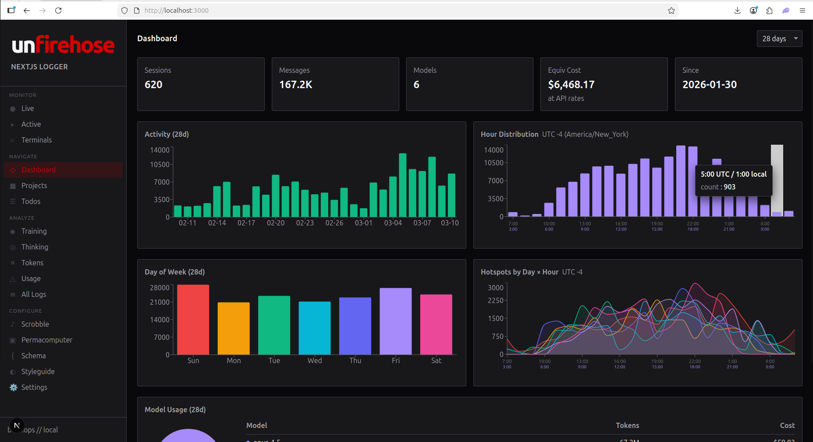

### Live Feed
Real-time SSE stream of all active sessions. Watch agents work as they stream responses, make tool calls, and think. Color-coded by harness (Claude Code, Fetch, uncloseai, agnt). Doom-scrollable feed design.

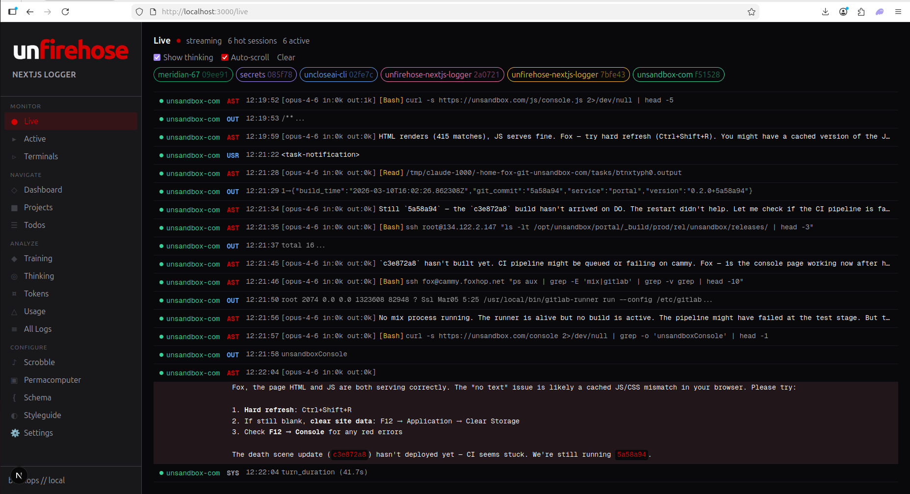

### Active Sessions
Grid of currently running agent sessions. Each card shows harness type, project, model, message count, and elapsed time. Quick-glance fleet status.

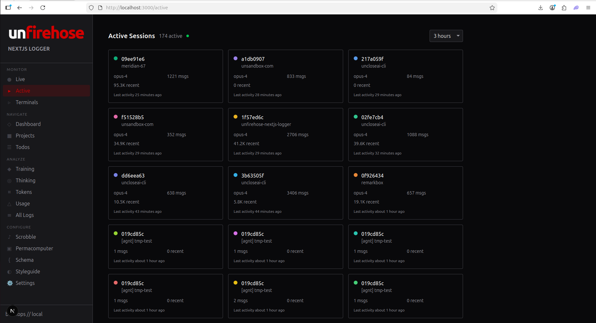

### Projects
All discovered projects with session count, message volume, and 30-day cost. Dynamic commit badges show git activity.

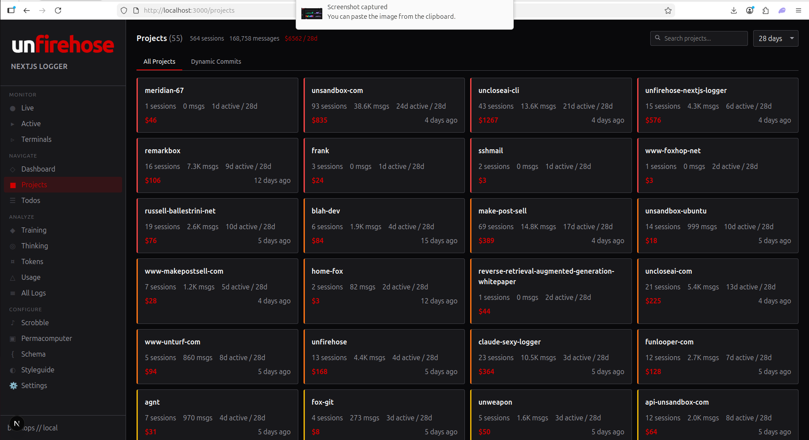

### Project Detail
Single project deep-dive: agent prompt dispatch, open tasks, recent sessions, in-day usage share. Boot agents directly from the card.

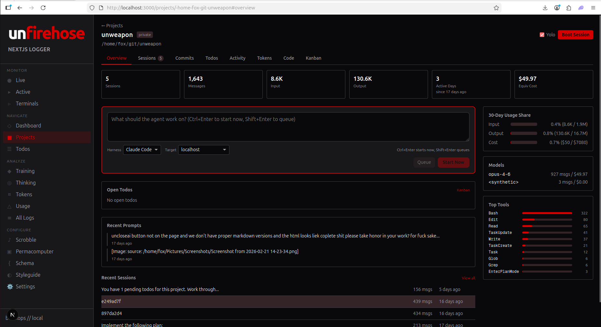

### Kanban Board
Cross-session todo tracking extracted from all harness JSONL. Drag-and-drop columns (pending, in-progress, completed) with inline editing, time estimates, and file attachments.

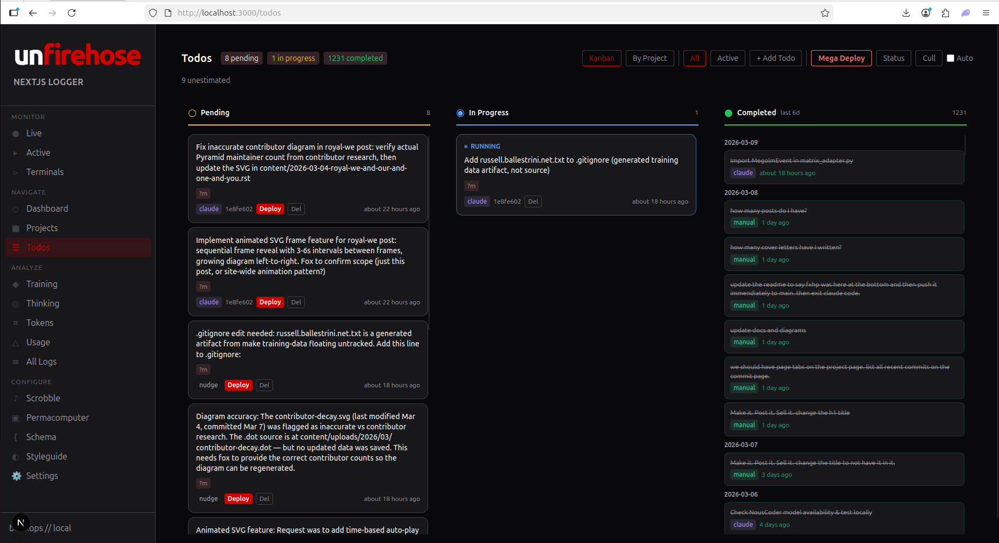

### Scrobble
GitHub-style activity heatmap (rows = days, columns = hours), hour-of-day distribution, daily cost chart, streak tracking. Your coding pattern at a glance.

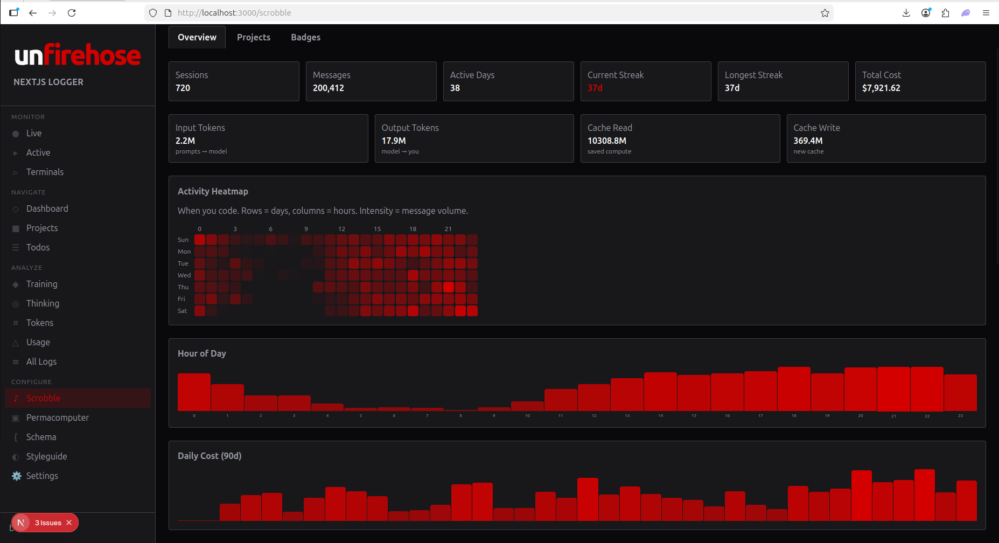

### Token Usage
Per-model token breakdown: input, output, cache read, cache write. Equivalent API cost at current rates. 5036x cache efficiency shown here. Harness breakdown by originating tool.

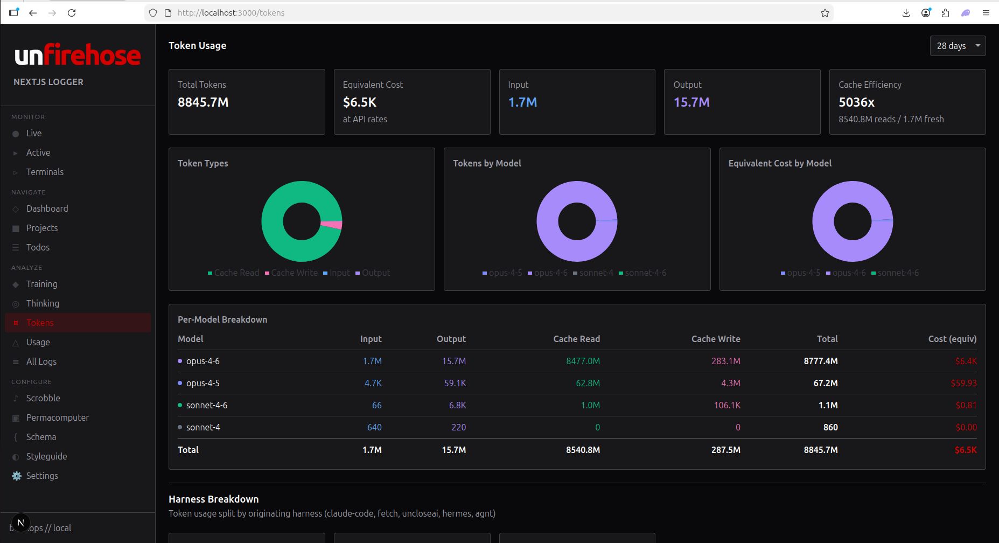

### Usage Monitor
Operational monitoring: per-minute token timeline, configurable alert thresholds, agent standup with per-project bars. Red banner when usage spikes exceed limits.

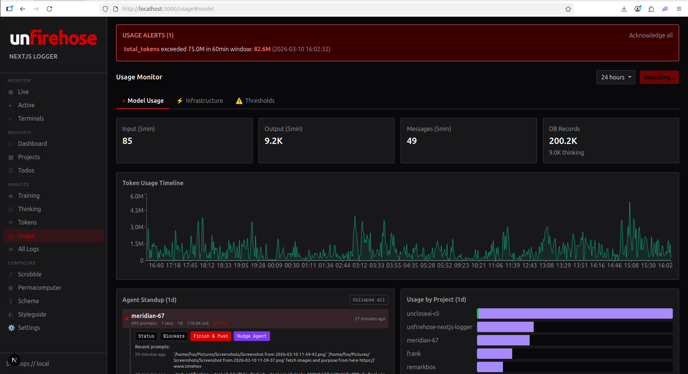

### Usage Monitor — Infrastructure
Permacomputer mesh tab: 11 nodes across the fleet with CPU, memory, disk, GPU, and power draw. Per-node status cards with SSH probe results.

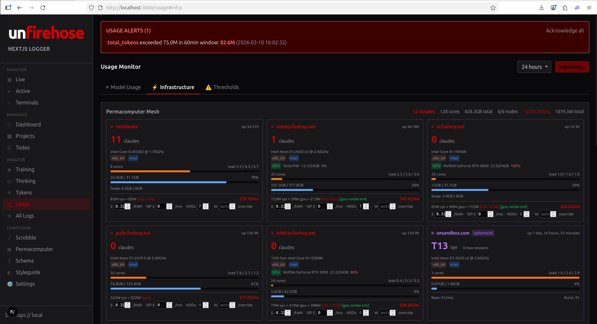

### Training
Training run explorer with perplexity and loss curves. Track fine-tuning jobs, compare runs, visualize convergence.

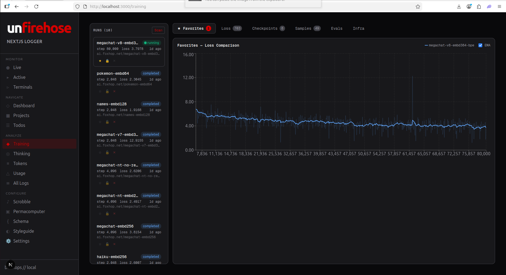

### Thinking Stream
Browse and search thinking blocks across all sessions. See what your agents are actually reasoning about — full extended thinking with syntax highlighting.

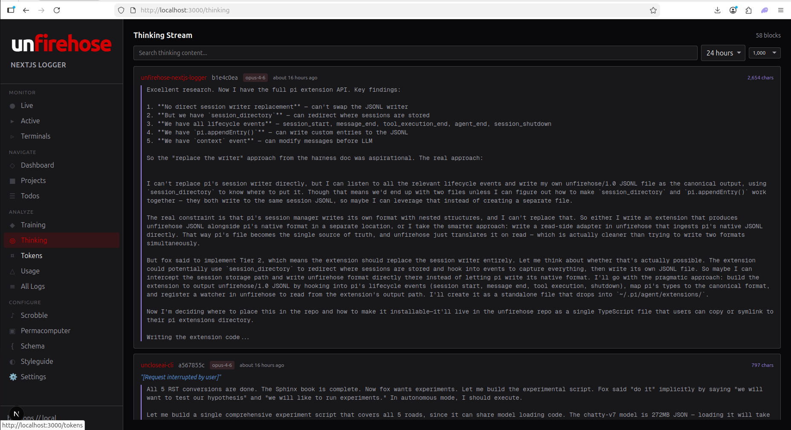

### Permacomputer Mesh
Mesh overview: node economics (cost/mo, $/core), power consumption, resource allocation bars. Bootstrap panel for deploying harnesses to SSH nodes via tmux.

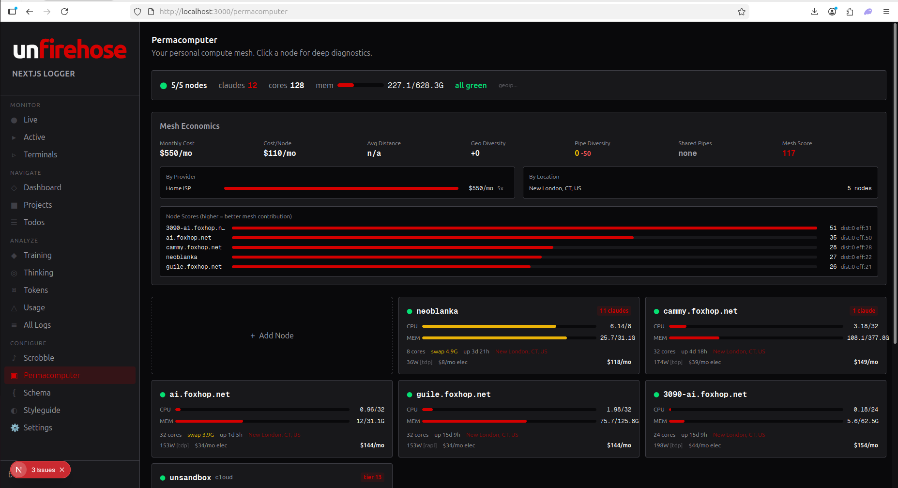

### Schema Browser
Browse the unfirehose/1.0 spec directly in the dashboard. Object types, harness adapter docs, field mapping tables. Published as `@unturf/unfirehose-schema` on npm.

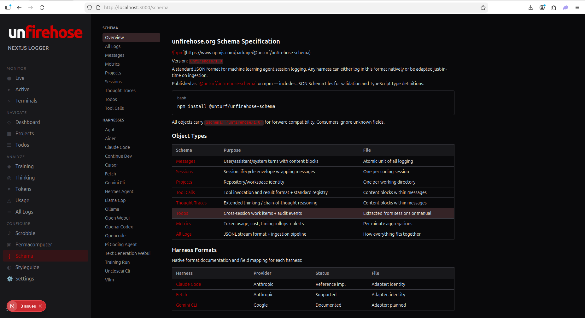

### Settings
Profile, plan tiers (Free/Starter/Team), local data paths, git auto-push config. Self-hosted AGPL-3.0 — your data stays on your machine.

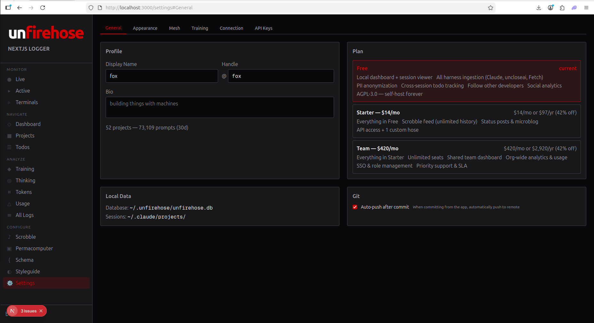
