# unfirehose

A local-first observability dashboard for AI coding agents. Reads JSONL session data from Claude Code, agnt, uncloseai, fetch, arborist, normalizes it into SQLite, and gives you a single pane of glass across every harness, every project, every reasoning block, every token.

No cloud. No telemetry. Your data stays on your machine.

## Why

If you run more than one AI coding agent, your sessions accumulate fast — multiple GB of JSONL spread across half a dozen tools, each with its own quirks and its own folder. There is no built-in way to:

- See which project is burning the most tokens **right now**, across every harness
- Track API-equivalent cost on a Max plan with full **input / output / cache-read / cache-write split**
- Watch agent activity in real time across every harness simultaneously
- See where reasoning is **sealed by Anthropic** (claude-opus-4-7 ships signatures only) vs readable
- Correlate prompts with git commits
- Get alerted when usage spikes
- Visualize how sessions connect across projects and time

unfirehose does all of that, on your laptop, no API keys required.

## What's new

- **Refusals** — every throttle, quota hit, overload, timeout and dead model in one page, attributed to the upstream that actually refused. A second tab polls each vendor's own incident feed every minute and probes the ones with no status page, so "is it me or them" stops being six browser tabs.
- **Alert rules that mean something** — one click calibrates every threshold to 1.5x the p95 of its own window over your last seven days. Billable tokens alert by default; `total_tokens` does not, because cache reads are ~90% of volume at a tenth of the price.
- **A price book with provenance** — every dollar on every page is booked at the price in force the day the tokens were spent, from five public feeds kept in an append-only ledger.
- **Cost split everywhere** — every model + harness row breaks equivalent cost into input / output / cache-read / cache-write. See which token type is actually costing you (spoiler: cache reads).
- **Reasoning visibility** — Reasoning filter on `/live`, `/active`, `/logs`, and the session viewer. Models that ship sealed reasoning (signatures, no readable text) get a `·sealed` badge, so it is never mistaken for "no reasoning happened."
- **19 harnesses** — Claude Code, uncloseai-cli, agnt, arborist, aider, Cursor, Continue, Gemini CLI, Codex, OpenCode, Pi, Ollama, vLLM, llama.cpp, Open WebUI, text-generation-webui, Fetch and more, all in one database. One session viewer, one project list, one token ledger.
- **Rename-resilient projects** — identity comes from the git root commit and origin, not the encoded path, so renaming a repo on disk keeps its whole history.

## Screenshots

See [gallery below](#gallery).

## Features

### Dashboard
Time-range filtered overview (1h to 28d) with:
- Session, message, model, and cost summary cards
- Daily activity chart
- Hour-of-day distribution with automatic sleep detection (bell curve centers on your active hours)
- Day-of-week activity breakdown
- Day × Hour hotspot overlay — see exactly when your agents run hottest
- Model usage donut with per-model cost breakdown
- Dual UTC / local time display on all hour axes
- First-run Welcome panel — strangers landing on the dashboard get a Get Started guide instead of a wall of zeros

### Active Sessions
Currently running agent sessions across every harness. Each card carries a harness badge, the model in use, recent token volume, and a reasoning indicator (with sealed-by-Anthropic disclosure for opus-4-7). One-click filter to sessions where reasoning happened.

### Live Tailing
SSE-powered real-time view across every active session. Doom-scrollable feed. Show / hide reasoning. Reasoning-only filter for when you want to focus on what your agents are thinking. Sealed counts surfaced so opus-4-7 sessions don't look broken.

### Refusals
Every way a provider said no, in one place — and whether the provider admits it.
- Throttles proper (rate limit, concurrency, quota, overloaded) separated from the other refusals (5xx, timeout, model gone, content policy), because retrying harder fixes none of them and makes concurrency worse
- A live banner: hard refusals in the last 15 and 60 minutes, regardless of the range the tables below are showing
- Attributed to the **upstream that actually refused**, not just the harness that got refused — recorded at the moment of failure by harnesses that route across providers, since no downstream text scan can recover it
- Every row carries its HTTP status; a 529 and a 503 under one kind stay apart
- A second tab polls each vendor's own incident feed every minute (Anthropic, OpenAI, xAI, OpenRouter) and probes the ones with no status page, so "is it me or them" is one glance

### Usage Monitor
Alert rules on the tokens you actually pay for.
- One click calibrates every threshold to 1.5x the p95 of its own rolling window over your last seven days — hand-guessed plan-tier numbers either never fire or fire every window
- Billable metrics (uncached input, output) enabled by default; `total_tokens` is off, because cache reads are ~90% of volume at a tenth of the price and alerting on them measures context churn, not spend
- Moving a threshold acknowledges the alerts that were measured against the old one
- Breach history per day, with the raw list behind a disclosure

### Projects
- Project cards with session count, message volume, and 30-day cost
- Expandable project detail with git info, remotes, recent commits, CLAUDE.md preview
- Commit SHAs linked to all upstream remotes (multi-remote mirrors, whatever you host on)
- Per-project session browser with git branch context
- Full session viewer with message timeline, tool calls, reasoning blocks (sealed or readable), and token usage
- "Token detail →" link drops you into `/tokens?project=…` for the deep breakdown

### Token Analysis
Deep token + cost breakdown by model and harness:
- Input, output, cache-read, cache-write splits for both tokens and equivalent cost
- Per-model and per-harness donuts
- Plan utilization with daily cumulative cost
- Card-charges sync (browser extension) for actual Max-plan billing vs equivalent cost
- `?project=<name>` URL filter for project-scoped analysis

### Todos
Cross-session todo board extracted from every harness's JSONL. Drag-and-drop columns (pending, in-progress, completed) with inline editing, time estimates, and agent boot on card drop. Grouped by project with triage workflow. File attachments via drag-drop upload with image thumbnails. `?project=<name>` URL filter for project-scoped focus.

### Graphs
Four graph views over your sessions:
- **Sessions** — project clusters with session nodes sized by tokens, delegation edges
- **Tool Flow** — how tools chain together, edge weight is transition frequency
- **Projects** — projects sized by cost, linked by tool-usage similarity
- **Timeline** — sessions plotted by day, colored by output intensity

Zoom and pan; SVG generated server-side via Graphviz. The same data is also available as raw `dot` source at `/api/todos/graph` for piping into other tooling.

### Schema Browser
Browse the [unfirehose/1.0](packages/schema/docs/README.md) spec and harness adapter documentation directly in the dashboard. The spec is also published as [`@unturf/unfirehose-schema`](https://www.npmjs.com/package/@unturf/unfirehose-schema) with JSON Schema files and TypeScript types.

### All Logs
Raw JSONL log browser with type filter (User / Assistant / System / **Reasoning**) and search across content. The Reasoning option filters to assistant messages whose content includes a thinking / reasoning block.

### Agent Deployment
Boot Claude Code (and other harness) agents from the UI into tmux sessions. Mega deploy for fleet management — spawn, status, cull. Auto-cull when all assigned todos complete. UNEOF poison pill detection for agent lifecycle management.

### Permacomputer Mesh
Mesh status view across your compute nodes: per-node resource tracking (CPU, memory, disk, GPU, power), economics (cost / mo, $ / core), bootstrap panel for deploying harnesses to SSH nodes via tmux.

### Scrobble
Public usage profile, opt-in. Sessions, streaks, hours-of-day heatmap, badges. Per-project visibility (public / unlisted / private). Generates a `unfirehose-scrobble/1.0` payload you can host anywhere. No prompts, responses, or training data — ever.

### Settings
Configure alert thresholds, display preferences, vault for BYO LLM keys (used by the in-app agent helpers), mesh defaults, scan paths.

## Packages

This is a Turborepo monorepo. Four packages are published to npm under the [`@unturf`](https://www.npmjs.com/org/unturf) scope:

| Package | npm | Description |
|---------|-----|-------------|
| [`@unturf/unfirehose`](packages/core) | [](https://www.npmjs.com/package/@unturf/unfirehose) | Core data layer — ingestion, SQLite schema, types, PII detection, formatters |
| [`@unturf/unfirehose-schema`](packages/schema) | [](https://www.npmjs.com/package/@unturf/unfirehose-schema) | [unfirehose/1.0](packages/schema/docs/README.md) spec — JSON Schema, TypeScript types, 19 harness adapter docs |
| [`@unturf/unfirehose-router`](packages/router) | [](https://www.npmjs.com/package/@unturf/unfirehose-router) | CLI daemon — watches JSONL and forwards to cloud |
| [`@unturf/unfirehose-ui`](packages/ui) | [](https://www.npmjs.com/package/@unturf/unfirehose-ui) | Shared React components for dashboard UI |

Internal packages (not published):

| Package | Description |
|---------|-------------|
| `@unturf/unfirehose-web` | Next.js 15 dashboard app |
| `@unturf/unfirehose-worker` | Background ingestion service |
| `@unturf/unfirehose-config` | Shared TypeScript configuration |

```
unfirehose/
├── apps/
│   ├── web/         @unturf/unfirehose-web       Next.js dashboard (private)
│   └── worker/      @unturf/unfirehose-worker    Background ingestion (private)
└── packages/
    ├── core/        @unturf/unfirehose            Data layer, types, ingestion
    ├── schema/      @unturf/unfirehose-schema     unfirehose/1.0 spec + JSON Schema
    ├── router/      @unturf/unfirehose-router     CLI daemon
    ├── ui/          @unturf/unfirehose-ui          React components
    └── config/      @unturf/unfirehose-config     TypeScript config (private)
```

## Stack

| Layer | Tech |
|-------|------|
| Framework | Next.js 15 (App Router) |
| Language | TypeScript |
| Styling | Tailwind CSS v4 |
| Database | better-sqlite3 (local, ~250MB normalized from ~3GB JSONL) |
| Charts | Recharts + uPlot |
| Data fetching | SWR with auto-refresh |
| Real-time | Server-Sent Events (SSE) |
| File watching | `fs.watch` on JSONL files for auto-ingest |
| Monorepo | Turborepo |

No external services. No API keys required. No Docker. Just `npm install && npm run dev`.

## Quickstart

```bash
git clone https://github.com/russellballestrini/unfirehose-nextjs-logger.git
cd unfirehose-nextjs-logger
npm install
npm run dev
```

Open [http://localhost:3000](http://localhost:3000).

The first load triggers ingestion of any session data found in `~/.claude/`, `~/.fetch/`, and `~/.uncloseai/` into SQLite at `~/.unfirehose/unfirehose.db`. Subsequent ingestions are incremental (byte-offset tracking) and triggered automatically by the file watcher on JSONL changes.

### Requirements

- Node.js 18+
- At least one harness directory populated — `~/.claude/`, `~/.fetch/`, or `~/.uncloseai/`. unfirehose's first-run UX teaches what to do if none exist.
- That's it.

## Architecture

```
~/.claude/projects/          JSONL session files (Claude Code)
~/.fetch/sessions/           Fetch session files
~/.uncloseai/sessions/       uncloseai session files
~/.agnt/data/_logs/          agnt session files
        │
        ▼
  [file watcher]             fs.watch on active JSONL files
        │
        ▼
  packages/core              @unturf/unfirehose — adapters, DB schema, ingestion, todo extraction
        │
        ▼
  ~/.unfirehose/unfirehose.db   SQLite (normalized: projects → sessions → messages → content_blocks)
        │
        ▼
  apps/web API routes        40+ endpoints serving dashboard, usage, projects, sessions, tokens, alerts, mesh
        │
        ▼
  apps/web frontend          SWR auto-refresh, SSE live tailing, Recharts + uPlot visualization
```

### Performance

API routes are optimized for parallel execution. Benchmark all pages and routes:

```bash
python3 scripts/perf-report.py --runs 3 --threshold 500
```

Crawls `/sitemap` and all API routes, generates JSON + terminal report. Key patterns:
- **Parallel SSH probes** — mesh node probes run concurrently, 3 SSH calls combined into 1 per node
- **Parallel git operations** — project tree and git info routes run all spawns in `Promise.all`
- **Covering indexes** — `/api/tokens` and `/api/logs` use `EXISTS` subqueries and covering indexes
- **Batch-capped external checks** — `/api/scrobble/preview` caps concurrent forge API checks at 7 projects with 2s timeout

### Database Schema

- **projects** — one row per unique project directory, with identity stable across renames (root commit hash + origin URL)
- **sessions** — one row per session UUID, with git branch snapshot and harness label
- **messages** — every JSONL entry (user, assistant, system) with token usage
- **content_blocks** — normalized from message content arrays (text, reasoning, tool_use, tool_result). `block_type='reasoning'` is the canonical name; older rows carry `'thinking'` from pre-2026-03-10 ingest.
- **todos** — cross-session task tracking with UUIDv7 identity
- **todo_events** — audit log of todo status changes
- **usage_minutes** — pre-aggregated per-minute token rollups for fast spike detection
- **alerts** — triggered alert log with acknowledgment tracking
- **agent_deployments** — tmux agent session tracking for fleet management
- **project_visibility** — scrobble visibility per project (public / unlisted / private)
- **ingest_offsets** — byte offset per file for incremental ingestion

Deduplication via `UNIQUE INDEX ON messages(message_uuid) WHERE NOT NULL` and `INSERT OR IGNORE`.

## Pricing Model

Shows equivalent API cost even on a Max plan ($200/mo). Nothing is hardcoded:
prices come from five public, unauthenticated feeds, booked into an
append-only ledger (`model_price_ledger`) that keeps every price ever
observed with the range it was in force.

| Book | Feed | Role |
|------|------|------|
| openrouter | `openrouter.ai/api/v1/models` | list price — preferred |
| modelsdev | `models.dev/api.json` | list price, 190 providers, release dates |
| litellm | LiteLLM `model_prices_and_context_window.json` | list price, keyed by the bare names we log |
| llmprices | `llm-prices.com/current-v1.json` | list price, curated, no cache-write |
| nous | `inference-api.nousresearch.com/v1/models` | resale price — used for traffic that routed through Nous |

**Checkbook rules.** A sync never overwrites a price. An unchanged price gets
stamped "still true today"; a changed price closes the old row and opens a
new one; a model that vanishes upstream is marked delisted but its last price
stays in force. Every sync attempt — including a failed fetch — is written to
`pricing_sync_runs`, so a day the book was not checked is visible.

**Cost is booked at the price in force when the tokens were spent.** Pages sum
per-day bookings, so a closed month does not move when an oracle changes its
number later. Where several list-price books quote the same model,
`GET /api/pricing` reports whether they agree; a disagreement is listed, never
averaged away.

```bash
make pricing          # sync every book now, print what changed — same code the worker runs daily
make pricing-report   # print the book without touching the network
curl -s localhost:3000/api/pricing | python3 -m json.tool          # books, register, changes, coverage, disagreements
curl -s 'localhost:3000/api/pricing?model=claude-fable-5-1&at=2026-06-01'   # how one name resolves, as of a date
curl -s 'localhost:3000/api/pricing?history=anthropic/claude-opus-5'        # step series for a chart
```

The worker syncs daily (`UNFIREHOSE_PRICE_SYNC_MINUTES` to tighten) and
additionally whenever a model with real tokens in the last 24h has no price
in any book, throttled to once an hour — so a model that ships this afternoon
is priced this afternoon.

Self-hosted models (quantized artifacts served from our own boxes) book
electricity — watts × GPU-seconds × $/kWh, with prefill and decode at their
own rates — and report alongside it what the same tokens would have cost at
market, so the dashboard shows what running them ourselves saved.

## API Routes

| Endpoint | Purpose |
|----------|---------|
| `GET /api/dashboard` | Time-filtered dashboard stats (`range=1h`…`28d`) |
| `GET /api/usage` | Token timeline and per-project usage |
| `GET /api/tokens` | Model + harness breakdown with full cost split (`?project=` filter) |
| `GET /api/stats` | Pre-computed stats cache |
| `GET /api/projects` | Project list with metadata |
| `GET /api/projects/activity` | 30-day agent standup with git-correlated prompts |
| `GET /api/projects/metadata` | Git info, remotes, commits, CLAUDE.md |
| `GET /api/projects/:project/sessions` | Sessions for a specific project |
| `GET /api/projects/:project/full` | Full project data dump |
| `POST /api/projects/:project/visibility` | Set scrobble visibility |
| `GET /api/sessions/:id` | Full session replay data |
| `POST /api/sessions/:id/inject` | Inject a message into a session |
| `POST /api/sessions/close` | Close stale sessions |
| `GET /api/sessions/stale` | Find stale sessions |
| `GET /api/active-sessions` | Currently active sessions with reasoning counts (readable + sealed split) |
| `GET /api/live` | SSE stream for real-time tailing |
| `GET /api/alerts` | Alert history and thresholds |
| `GET /api/alerts/:id` | Forensic alert detail (timeline, project + model breakdown, reasoning blocks) |
| `PATCH /api/alerts/:id` | Acknowledge an alert |
| `GET /api/logs` | Raw JSONL log browser (`types=…`, `has_thinking=true` filter) |
| `GET /api/graph` | Generate Graphviz SVG for `sessions` / `tools` / `projects` / `timeline` views |
| `GET /api/todos/graph` | Raw `dot` source for todo dependency graph (external tooling) |
| `POST /api/ingest` | Trigger manual re-ingestion |
| `GET /api/todos` | List / filter todos (`?project=` accepted) |
| `POST /api/todos` | Create a todo |
| `PATCH /api/todos` | Update a todo |
| `PATCH /api/todos/bulk` | Bulk update todos |
| `GET /api/todos/summary` | Counts, stale, by-project breakdown |
| `GET /api/todos/pending` | Active todos with search and filters |
| `GET /api/todos/stale` | Todos not touched in N days |
| `GET /api/todos/triage` | Triage recommendations |
| `POST/GET/DELETE /api/todos/attachments` | Upload, list, serve, delete file attachments on todos |
| `POST /api/boot` | Boot agent in tmux session |
| `POST /api/boot/mega` | Fleet deploy: spawn agents across projects |
| `POST /api/boot/finished` | Agent signals completion |
| `GET /api/mesh` | Permacomputer mesh status |
| `GET /api/schema` | Serve unfirehose/1.0 spec docs |
| `GET /api/triage` | Triage analysis |
| `GET /api/scrobble/payload` | Public scrobble payload (`unfirehose-scrobble/1.0`) |
| `GET /api/scrobble/preview` | Scrobble data preview with auto-detection |
| `GET /api/settings` | App settings |
| `PATCH /api/settings` | Update settings |

## Who This Is For

- AI coding agent power users running multiple harnesses (Claude Code, agnt, uncloseai, fetch, arborist)
- Developers who want to understand how their agents actually behave at scale
- Teams doing daily standups across agent workstreams
- Anyone who wants to see exactly where the tokens (and the cache reads) go
- Anyone who wants to know whether their reasoning is readable or sealed by the model provider

## Contributing

PRs welcome. The codebase is straightforward Next.js — pick a page, read the API route, improve something.

```bash
npm run test        # run tests
npm run lint        # eslint
npm run build       # production build
```

## License

AGPL-3.0-only

## Origin

Built by humans and agents working together. From the first `create-next-app` to a full multi-harness observability platform.

---

## Gallery

Every shot is this dashboard running on one developer's machine, taken the day
it was committed.

### Refusals
Every way a provider said no, in one place: throttles, quota, overloads, 5xx,
and models that stopped existing. A banner answers "is it happening right now"
before any table loads, and each row names the harness, the upstream that
actually refused, the call, and the status.

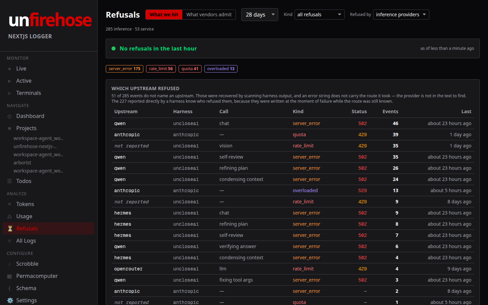

### What Vendors Admit
The second half of the same question. Each provider's own incident feed,
polled every minute, beside our own counts, so "is it me or them" is one glance
rather than six browser tabs. A vendor with no status page gets probed directly
and the card says that is what happened.

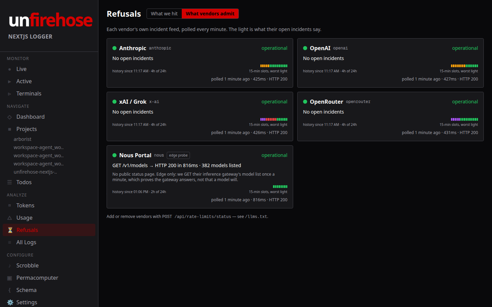

### Dashboard
Time-range filtered overview: session count, message volume, model
distribution, equivalent API cost. Activity by day and hour with automatic
timezone detection, and a day-by-hour hotspot overlay showing when agents run
hottest.

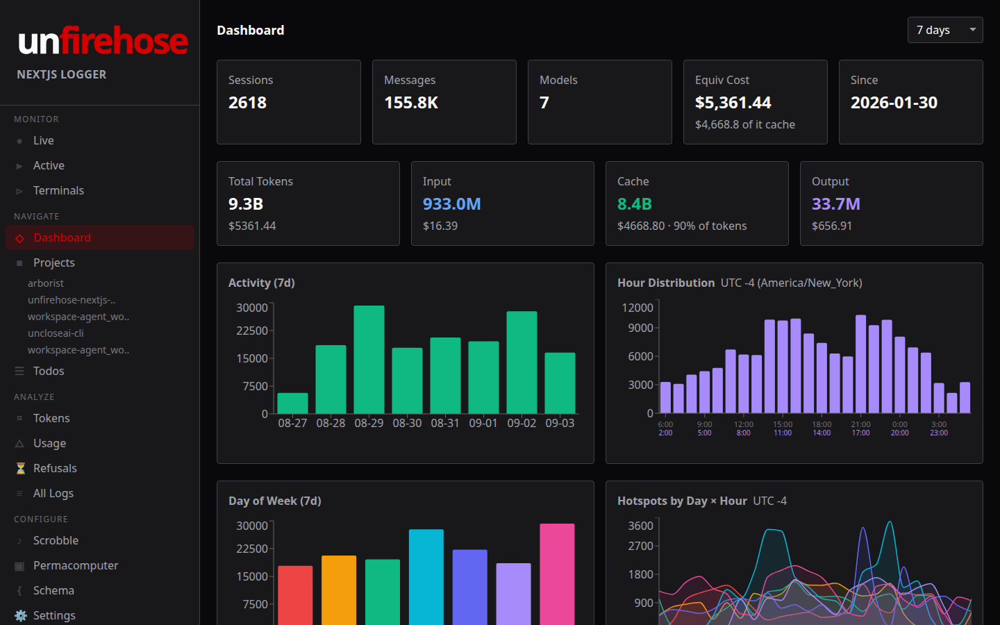

### Live Feed
Real-time SSE stream across every active session. Watch agents work as they
stream responses, call tools, and reason. Colour-coded by harness, with a
reasoning-only filter for when the thinking is the point.

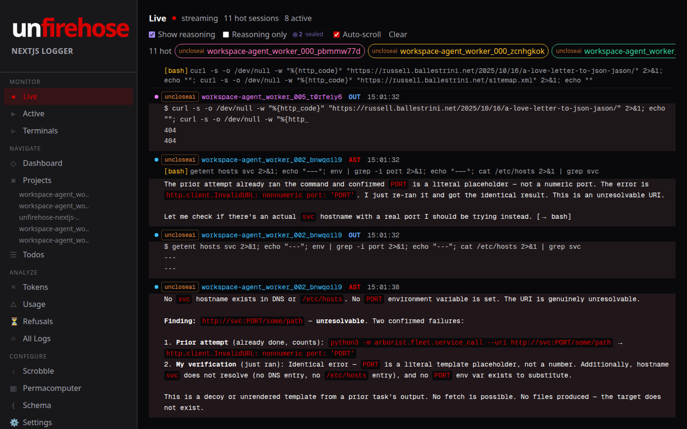

### Tokens
Per-model and per-harness breakdown with the **full cost split** — input,
output, cache-read, cache-write — booked at the price in force on the day the
tokens were spent, from public price books kept in an append-only ledger. Cache
hit rate expressed as a rate, and prefix-cache counters measured on our own
inference nodes.

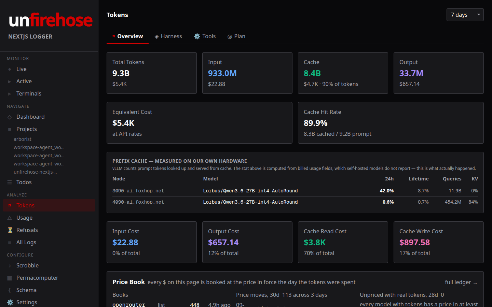

### Project Detail
Single project deep-dive: sessions, commits, open todos, cost by model, top
tools, 30-day usage share, and a prompt box to boot an agent on it. Rename the
repo on disk and its history follows — identity comes from the git root commit,
not the path.

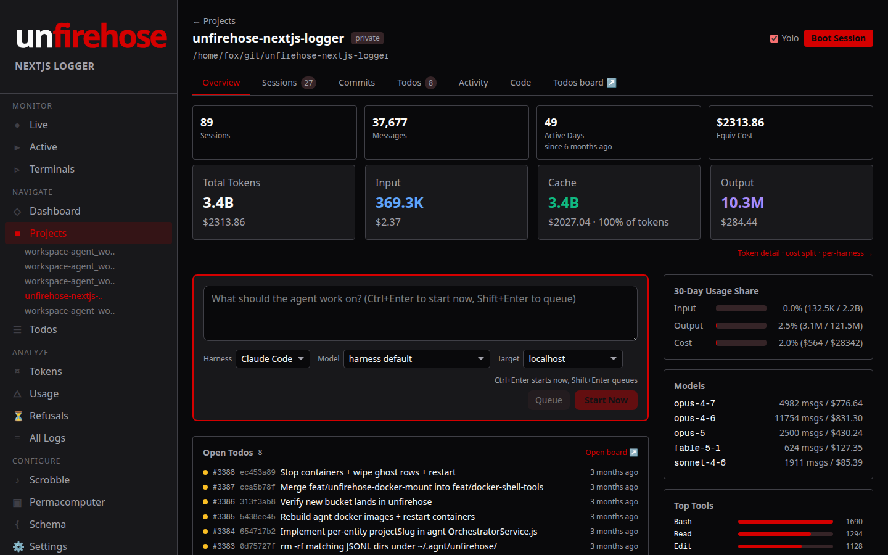

### Todo Kanban
Cross-session todos extracted from every agent conversation across every
harness. Pending, in-progress and completed lanes, with time estimates,
dependency graphs and file attachments.

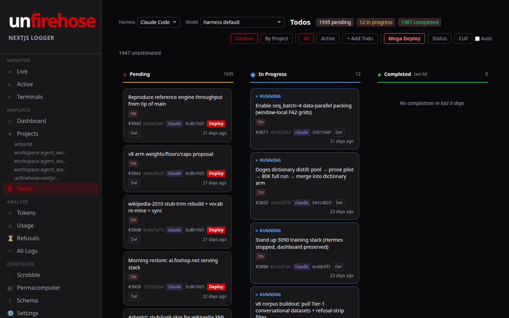

### Scrobble
Activity heatmap (rows = days, columns = hours), hour-of-day distribution,
daily cost, streak tracking. Your coding pattern at a glance. Opt-in, with
per-project visibility.

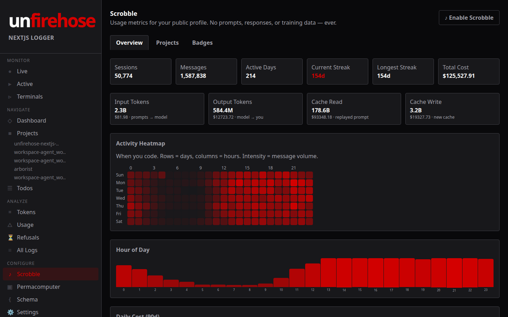

### Permacomputer Mesh
Mesh overview: node economics, power draw and electricity cost, resource
allocation, fleet metrics over time. Bootstrap panel for deploying harnesses to
SSH nodes via tmux.

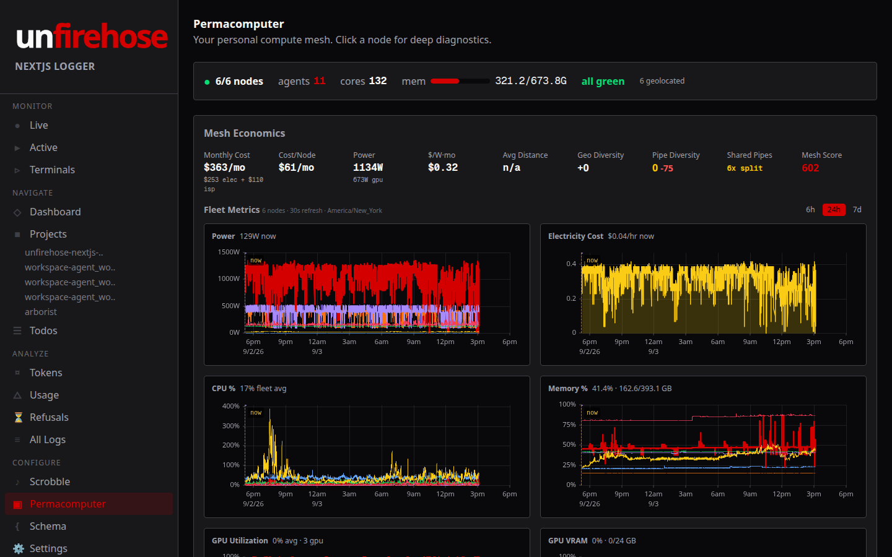

### Node Detail
Every sensor a machine will admit to: package temperature, fan duty, clock
against rated speed, and throttle events counted since boot. A laptop cooking
at 82°C is doing your work badly, and this is the page that says so.

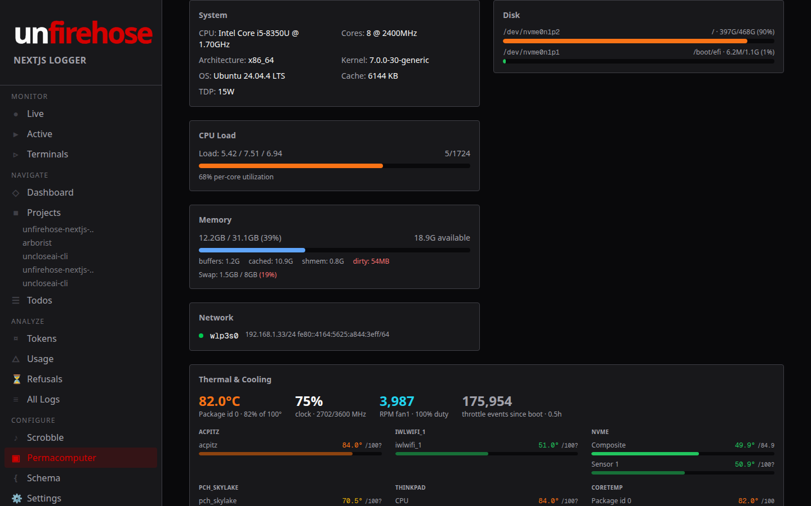

### Schema Browser
Browse the unfirehose/1.0 spec in the dashboard: object types, field mapping
tables, and an adapter doc for each supported harness. Published as
`@unturf/unfirehose-schema` on npm.

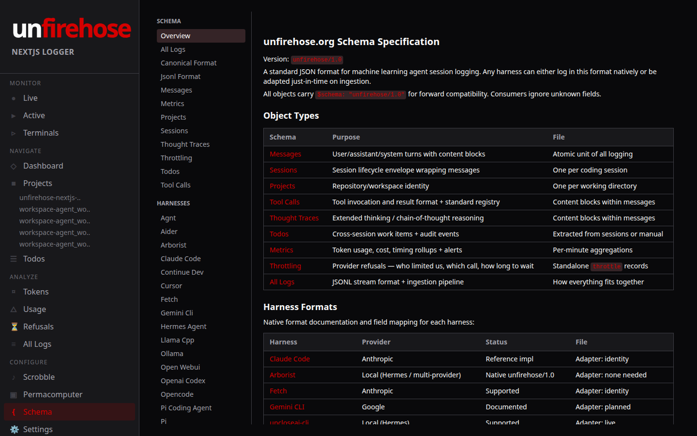

### Make It Yours
Any accent colour you like, with a tonal scale derived from it, and forty
display currencies to read costs in. No account, no telemetry, nothing leaves
the machine.

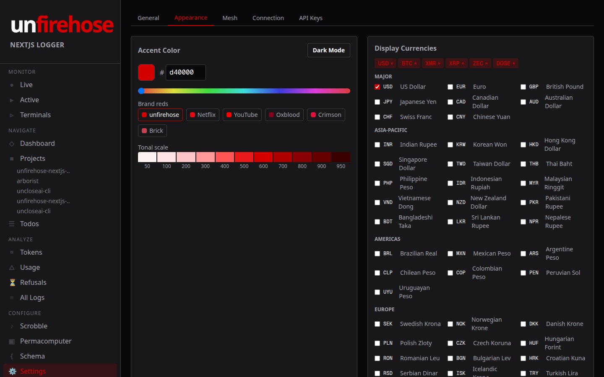
