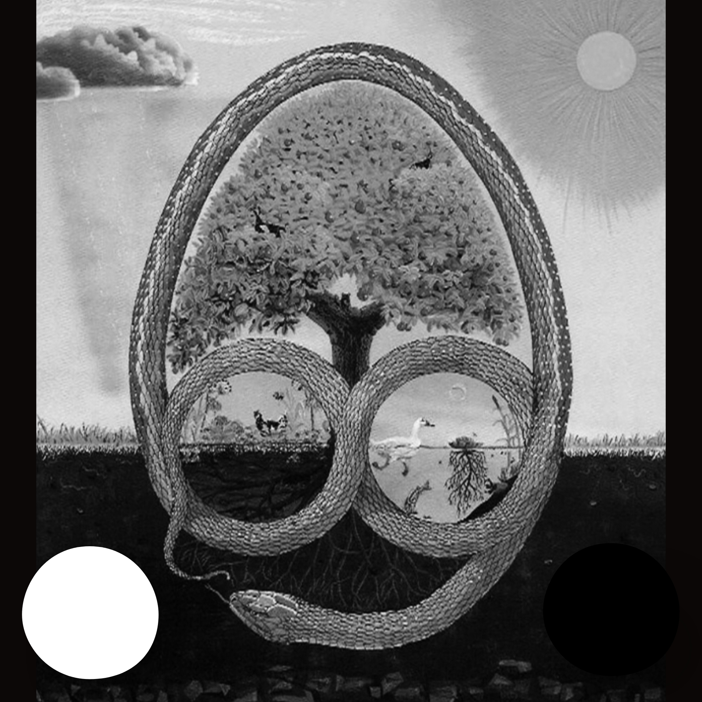

.. This is free software for the public good of a permacomputer hosted at
.. permacomputer.com, an always-on computer by the people, for the people.
.. One which is durable, easy to repair, & distributed like tap water
.. for machine learning intelligence.
..
.. The permacomputer is community-owned infrastructure optimized around
.. four values:
..
..   TRUTH      First principles, math & science, open source code freely distributed
..   FREEDOM    Voluntary partnerships, freedom from tyranny & corporate control
..   HARMONY    Minimal waste, self-renewing systems with diverse thriving connections
..   LOVE       Be yourself without hurting others, cooperation through natural law
..
.. This paper introduces Merkle Providence: a provenance-preserving cache layer
.. that lets small language models punch far outside their parameter class by
.. combining Reverse RAG context injection with Merkle-tree-verified answer chains.
.. Our reference implementation runs on Hermes 3, a NousResearch fine-tune of
.. Meta's Llama 3.1 8B, served freely at uncloseai.com.
.. Public chains share verified knowledge. Private chains stay local.
.. Code is seeds to sprout on any abandoned technology.

Unturf Automated General Intelligence: Merkle Providence Reverse RAG
======================================================================

.. class:: center

**Provenance-Preserving Cache Chains for Small Language Models**

.. class:: center

*How Merkle trees turn Reverse RAG into a verifiable, shared knowledge layer.*

.. class:: center

*How Hermes 3 Llama 3.1 8B answers with the confidence of a verified record, not a guess.*

.. class:: center

*Russell Ballestrini <russell@unturf.com>, David Wong <david.s.wong@pm.me>, Riley Morgan <guybriley02@gmail.com>*

.. class:: center

`unfirehose.com <https://unfirehose.com>`_ · `uncloseai.com <https://uncloseai.com>`_ · `permacomputer.com <https://www.permacomputer.com>`_

.. class:: center

*April 2026*

----

Abstract
--------

.. class:: center

**License: AGPL-3.0-only** · This algorithm, its implementation, & all associated code carry the GNU Affero General Public License v3.0 (only). You may use, modify, & distribute under those terms. No proprietary relicensing exists.

`Reverse Retrieval Augmented Generation (Reverse RAG) <https://uncloseai.com/reverse-retrieval-augmented-generations-rag.html>`_ demonstrated that client-side context injection lets small 8B-parameter language models outperform much larger models on page-specific questions. Our reference implementation runs **Hermes 3**, a NousResearch instruction fine-tune of Meta's Llama 3.1 8B, served freely at `uncloseai.com <https://uncloseai.com>`_. Our prior work showed that the client already holds the document. No vector database required. No embedding pipeline. No retrieval failures.

**Merkle Providence Reverse RAG** extends this with a second insight: the client not only holds the document, it can *remember what it already computed about that document*, prove that memory came from an unmodified source, & share that verified knowledge with others on public or private chains.

A Merkle tree over document content chunks produces a root hash: a 32-byte fingerprint that changes when any part of the document changes. Pairing this root hash with a question hash yields a cache key. A cache hit means a previously computed answer returns instantly, with a Merkle proof of origin. A cache miss triggers fresh inference, stores the result, & extends our chain.

**Unfirehose** serves as our chain substrate. Every inference session produces JSONL records that feed into SQLite at ``~/.unfirehose/unfirehose.db``. Public chains broadcast verified answer records to peers. Private chains stay local. Either way, a small model gains access to a growing body of pre-verified answers, each carrying cryptographic proof of the document version that produced it.

This combination removes two limits that have constrained small models:

1. **The repetition tax**: answering the same question about the same document on every visit, burning inference tokens & time, producing answers that may vary slightly each run.
2. **The trust deficit**: small models hallucinate. Cached answers with Merkle proofs do not hallucinate. They either match a verified record or they do not exist yet.

Once published, this technique forces a reckoning: every RAG system that cannot prove provenance of its retrieved chunks operates on unverifiable context. Merkle Providence makes provenance a first-class primitive.

We call this stack **Web 2.5**: the existing web's documents & URIs, augmented with machine learning context injection & Merkle-verified answer chains, without requiring a blockchain, a new protocol, or replacement of any existing infrastructure. Web 2.5 runs on top of what already exists. Any page. Any browser. Any small model. Public or private chain. No permission required.

Reference Model: Hermes 3 Llama 3.1 8B
----------------------------------------

Our reference implementation runs on **Hermes 3**, a fine-tune of Meta's Llama 3.1 8B developed by NousResearch. Hermes 3 builds on Llama 3.1's 128k context window & adds instruction alignment, function-calling discipline, & reasoning consistency that raw base models lack. NousResearch trained Hermes 3 to follow multi-turn conversation formats precisely, making it reliable for our structured providence cache interactions.

We chose Hermes 3 Llama 3.1 8B for three reasons:

**Size matches our thesis.** 8 billion parameters represent a model any person can run on consumer hardware. Our reference deployment hardware & quantization details stay current at `uncloseai.com/inference.html <https://uncloseai.com/inference.html>`_. Our technique produces no value if it requires expensive hardware to demonstrate.

**Fine-tuning demonstrates our point.** Hermes 3 shows that fine-tuning a base model for instruction following, not scaling parameters, produces the reliability gains that matter for user-facing applications. Our Merkle Providence layer extends this logic: fine-tuned behavior + verified cached context beats raw parameter count.

**uncloseai.com serves it freely.** Our public inference endpoint at `uncloseai.com <https://uncloseai.com>`_ runs Hermes 3 Llama 3.1 8B at no cost to any user. Our Reverse RAG pipeline in ``uncloseai.js`` targets this endpoint by default. Our Merkle Providence cache layer builds directly on this existing infrastructure. Any person anywhere, on any device with a browser, accesses our same Hermes 3 instance our paper describes.

Hermes 3 Llama 3.1 8B outperforms many larger models on page-specific questions when Reverse RAG supplies full context. With Merkle Providence caching, it delivers consistent, verifiable answers across sessions. Our paper uses Hermes 3 throughout all examples & benchmarks.

1. The Problem Reverse RAG Left Open
--------------------------------------

Reverse RAG solved context retrieval. Client-side DOM extraction replaced vector databases. Full-page injection replaced chunk fragmentation. Small models with perfect context outperformed large models with partial context.

One problem remained: **repetition**.

A user visits a technical document. Hermes 3 Llama 3.1 8B reads 8,000 tokens of page content, classifies the page, & answers their question. One hour later, a different user visits our same document. Our same Hermes 3 instance reads our same 8,000 tokens, classifies our same page, & answers a similar question again. Tomorrow, a third user. Our same 8,000 tokens. Our same classification. Our same inference cycle.

Nothing remembered. Nothing reused. No proof that any two answers came from our same source.

This repetition carries three costs:

- **Compute cost**: every visit re-runs inference on content that has not changed.
- **Consistency cost**: stochastic inference on identical inputs produces slightly different answers. Two users asking near-identical questions may receive meaningfully different responses from our same page.
- **Trust cost**: no mechanism exists to verify that an answer actually derived from a specific document version. A model can claim anything.

Merkle Providence addresses all three.

2. Merkle Trees as Content-Addressed Cache Keys
--------------------------------------------------

A Merkle tree splits a document into chunks, hashes each chunk, then builds a binary tree of hashes upward until a single root hash remains. This root hash has two properties that make it ideal for caching:

**Property 1: Determinism.** Our same document always produces our same root hash. Two clients processing our same page independently compute identical roots. No coordination required.

**Property 2: Tamper sensitivity.** Any change to any byte of the document changes at least one leaf hash, which propagates upward to invalidate our root. A document that changed since our last visit produces a new root hash automatically. Our cache never serves a stale answer for a modified document.

Cache key construction::

    document_root = merkle_root(chunks(page_content))
    question_key  = sha256(normalize(user_question))
    cache_key     = document_root + ":" + question_key

A cache hit at this key means: *an earlier session computed an answer to this question, about this exact version of this document.* Our answer arrives in O(1) time. Our Merkle proof confirms our document version.

A cache miss means: run inference, store our result, extend our chain.

**Git & Mercurial are already Merkle trees.** For source code repositories, we do not need to build our own Merkle tree. Every git commit hash IS a Merkle root: a SHA-1 (or SHA-256 in git 2.x) digest of our entire repository tree at that point in time. Every ``hg`` commit carries an identical guarantee. The version control system has already done our hashing work.

For codebases, our cache key simplifies to::

    document_root = git_commit_hash   # or hg changeset hash
    question_key  = sha256(normalize(user_question))
    cache_key     = document_root + ":" + question_key

When a developer commits, our cache key changes automatically. Prior answers expire. Fresh inference runs against our new commit. No manual invalidation. No polling. Our version control system signals our cache boundary by design.

3. The Providence Layer: Proof of Origin
------------------------------------------

"Providence" carries two meanings that both apply here:

**Provenance**: where something came from. A Merkle proof lets any verifier confirm that an answer derived from a specific document version without receiving our full document. Our proof path, a sequence of sibling hashes from leaf to root, constitutes a compact cryptographic certificate of origin.

**Foresight**: the system appears to "already know" answers to questions asked before. From a user's perspective, a cache hit looks like instant comprehension. Our model responded before seemingly finishing to read. This resembles foresight because our prior sessions did our work ahead of time.

A providence record for a cached answer contains the full inference context::

    {
      "cache_key":        "abc123...:def456...",
      "document_root":    "sha256:abc123...",
      "document_uri":     "https://example.com/docs/api",
      "question_hash":    "def456...",
      "question_text":    "What does the rate_limit field mean?",
      "answer_text":      "The rate_limit field specifies...",
      "merkle_proof":     ["sha256:111...", "sha256:222...", ...],
      "model_id":         "adamo1139/Hermes-3-Llama-3.1-8B-FP8-Dynamic",
      "base_uri":         "https://hermes.ai.unturf.com/v1",
      "temperature":      0.1,
      "source_type":      "web",
      "git_commit":       null,
      "conversation_hash": "9a3f...",
      "turn_number":      1,
      "created_at":       1744000000,
      "hit_count":        0
    }

Our providence record collects maximum metadata, but only a subset enters our cache key. This distinction matters.

**Tier 1 — Cache Key Inputs.** A difference in any of these fields produces a distinct cache entry:

- ``document_root`` — content fingerprint (Merkle hash or git/hg commit)
- ``question_hash`` — SHA-256 of normalized question text
- ``model_id`` — canonical model identifier
- ``model_revision`` — exact weights revision (HuggingFace commit hash or equivalent)
- ``quantization`` — fp16, bf16, fp8, int8, int4, q4_k_m, etc. Same weights at different quantizations produce measurably different answers.
- ``conversation_hash`` — SHA-256 of the full normalized industry-standard chat messages array: every turn in order, system prompt through the final user message. A single-turn Q&A and a 6-turn conversation that arrives at the same final question produce different answers & different cache keys. Callers hash client-side & send only the hash. Message content never enters our logs — Operation Voyeur.
- ``seed`` — RNG seed when set. A seeded run produces a deterministic answer; a different seed produces a different one. Null seed entries cache on the other five fields alone.

**Tier 2 — Metadata Only.** Stored for research, routing, & audit. Not part of the key:

- ``base_uri`` — inference endpoint URI
- ``temperature``, ``top_p``, ``top_k`` — sampling parameters
- ``repetition_penalty``, ``frequency_penalty``, ``presence_penalty``
- ``max_tokens``, ``context_window``
- ``backend`` — vllm, llama.cpp, ollama, transformers, TGI
- ``node_id`` — mesh node that served the request
- ``inference_ms`` — wall-clock inference time

Tier 2 metadata does not affect cache correctness. Two answers produced at different temperatures from the same model, revision, & quantization, answering the same question about the same document, represent the same logical answer — stochastically equivalent. We store the temperature of the first run that populated our cache. Future hits return that answer regardless of the caller's temperature setting.

Any recipient of this record can verify our Merkle proof against our document root. If our document root matches what they compute from our same URI, our answer carries full provenance. If their computation produces a different root, our document changed, our answer no longer applies to their version.

4. Unfirehose as Chain Substrate
-----------------------------------

Unfirehose collects JSONL session data from machine learning harnesses across a mesh of compute nodes. Every tool call, every model response, every session event flows into ``~/.unfirehose/unfirehose.db`` via our background ingestion worker.

Our Merkle providence layer extends this existing infrastructure with a providence cache table::

    CREATE TABLE providence_cache (
      cache_key        TEXT PRIMARY KEY,
      document_root    TEXT NOT NULL,
      document_uri     TEXT NOT NULL,
      question_hash    TEXT NOT NULL,
      question_text    TEXT NOT NULL,
      answer_text      TEXT NOT NULL,
      merkle_proof     TEXT NOT NULL,  -- JSON array of sibling hashes
      model            TEXT NOT NULL,
      created_at       INTEGER NOT NULL,
      chain            TEXT NOT NULL DEFAULT 'private',
      peer_count       INTEGER NOT NULL DEFAULT 0
    );

    CREATE INDEX idx_providence_root ON providence_cache(document_root);
    CREATE INDEX idx_providence_uri  ON providence_cache(document_uri);

Two chain modes:

**Private chain**: records stay local at ``~/.unfirehose/``. Our personal session history. Our model learns from our own prior work on documents we visit repeatedly. Our chain belongs to us alone.

**Public chain**: records broadcast to peers via our unfirehose router daemon. Any node on our mesh that has processed our same document root can contribute answers. Any node that queries our same document root can receive pre-verified answers from others. Our chain grows with every participant.

Public chains do not share document content. They share proofs. Our Merkle proof proves an answer came from a specific document version without transmitting our document. Document content stays on our originating client, exactly as Reverse RAG intended.

5. How Small Models Punch Outside Their Weight Class
-------------------------------------------------------

Parameter count governs a model's ability to reason from first principles. Context quality governs a model's ability to answer questions about specific documents. Verified memory governs a model's ability to give consistent, trustworthy answers over time.

Large models win on reasoning from first principles. Small models, given the right tools, win on everything else.

Merkle Providence Reverse RAG gives small models three tools:

**Tool 1: Full context (from Reverse RAG).** Our same page injection described in our prior paper. Our model receives every word, every heading, every entity, every code block of our document. Nothing retrieved by cosine similarity. Nothing fragmented. Our full document, live from our DOM.

**Tool 2: Verified recall (from our providence cache).** Before our model reads our document, we check our cache. A cache hit returns our answer in milliseconds with a Merkle proof. Our model delivers a verified answer faster than any large model can load our full context. Our small model "already knew" because our prior session did our work.

**Tool 3: Peer-verified answers (from public chains).** On a public chain, our small model benefits from every session any participant ran against our same document version. A document processed by 100 sessions across our mesh produces a rich cache. Our Hermes 3 Llama 3.1 8B instance answers from our collective record, not just its own prior work.

These three tools operate at different timescales:

- **O(1)**: cache hit, local or peer. Instant. No inference required.
- **O(context)**: Reverse RAG with full page injection. Fast. One inference pass over complete context.
- **O(reasoning)**: fresh inference on novel questions. Standard. One inference pass, uncached.

A large model operates exclusively at O(reasoning). Our small model with Merkle Providence operates at O(1) for previously answered questions, O(context) for new questions on known documents, & O(reasoning) only for truly novel questions on new documents.

6. Architecture
-----------------

Stage 1: Document Fingerprinting
^^^^^^^^^^^^^^^^^^^^^^^^^^^^^^^^^^

Our same DOM extraction from Reverse RAG runs first. Once our extraction completes, we split our content into 512-token chunks & build our Merkle tree::

    function merkleRoot(chunks) {
        let layer = chunks.map(c => sha256(c));
        while (layer.length > 1) {
            const next = [];
            for (let i = 0; i < layer.length; i += 2) {
                const left  = layer[i];
                const right = layer[i + 1] ?? left;  // odd node doubles itself
                next.push(sha256(left + right));
            }
            layer = next;
        }
        return layer[0];
    }

Our root hash serves as our document fingerprint for our entire session. One hash computation. No server calls.

Stage 2: Cache Lookup
^^^^^^^^^^^^^^^^^^^^^^

Before any LLM call, we check our providence cache::

    async function lookupProvidence(documentRoot, questionText) {
        const questionHash = sha256(normalize(questionText));
        const cacheKey     = `${documentRoot}:${questionHash}`;

        // Check local chain first
        const local = await db.get(
            'SELECT * FROM providence_cache WHERE cache_key = ?',
            [cacheKey]
        );
        if (local) return { answer: local.answer_text, proof: local.merkle_proof, source: 'local' };

        // Check public chain peers
        if (publicChainEnabled) {
            const peer = await queryPeers(cacheKey);
            if (peer && verifyMerkleProof(peer.merkle_proof, documentRoot)) {
                await storeLocal(peer);  // cache locally for future hits
                return { answer: peer.answer_text, proof: peer.merkle_proof, source: 'peer' };
            }
        }

        return null;  // cache miss, proceed to inference
    }

Stage 3: Inference & Cache Write
^^^^^^^^^^^^^^^^^^^^^^^^^^^^^^^^^^

On a cache miss, our standard Reverse RAG inference runs. Once our answer arrives, we store our providence record::

    async function storeProvidence(documentRoot, documentUri, question, answer, model) {
        const questionHash = sha256(normalize(question));
        const cacheKey     = `${documentRoot}:${questionHash}`;
        const merkleProof  = computeProof(documentRoot, question);  // path to root

        await db.run(`
            INSERT OR REPLACE INTO providence_cache
            (cache_key, document_root, document_uri, question_hash, question_text,
             answer_text, merkle_proof, model, created_at, chain)
            VALUES (?, ?, ?, ?, ?, ?, ?, ?, ?, ?)
        `, [cacheKey, documentRoot, documentUri, questionHash, question,
            answer, JSON.stringify(merkleProof), model, Date.now(), chainMode]);

        if (chainMode === 'public') broadcastToMesh(cacheKey);
    }

Stage 4: Proof Verification
^^^^^^^^^^^^^^^^^^^^^^^^^^^^^

Any party that receives a providence record can verify it::

    function verifyMerkleProof(proof, claimedRoot, leafContent) {
        let current = sha256(leafContent);
        for (const sibling of proof) {
            current = sha256(current < sibling
                ? current + sibling
                : sibling + current);
        }
        return current === claimedRoot;
    }

If our document root computed from our verifier's live DOM matches ``claimedRoot``, our answer carries full provenance. Our answer derives from our exact document version our verifier currently views. If our roots diverge, our document changed. Our cache entry no longer applies.

7. Public vs. Private Chains
------------------------------

.. list-table::
   :header-rows: 1
   :widths: 20 40 40

   * - Property
     - Private Chain
     - Public Chain
   * - Storage
     - ``~/.unfirehose/`` local only
     - Broadcast via unfirehose router mesh
   * - Participants
     - One user, one machine
     - Any node on our mesh
   * - Document content shared
     - Never
     - Never (proofs only)
   * - Answer content shared
     - Never
     - Yes, with Merkle proof
   * - Trust model
     - Self-trust: our own prior work
     - Peer-trust: verified by Merkle proof
   * - Best for
     - Personal document libraries, sensitive internal docs
     - Open documentation, public research, shared reference material
   * - Cache growth rate
     - Linear in our own sessions
     - Linear in mesh participant sessions

Private chains suit corporate knowledge bases, personal research notes, any document our user does not want to share. Our local model benefits from our own prior sessions. No data leaves our machine.

Public chains suit open documentation, public APIs, research papers, any document where sharing verified answers benefits our community. No document content leaves our originating client. Proofs travel instead.

In our proposed design, our unfirehose router daemon would manage chain membership & peer discovery. Our user opts in to public chains per-document-domain or per-session. Our current implementation stays private.

8. Forcing the Issue
----------------------

Some technical formulations compel structural change not because they require adoption but because their existence makes our prior approach indefensible.

Our Merkle Providence layer forces one question onto every RAG system: *can you prove where your context came from?*

Traditional RAG retrieves chunks by cosine similarity. No chunk carries a Merkle proof. No retrieval carries a document fingerprint. Our retrieved context could come from a stale index, a corrupted chunk, or a document that changed since our last ingestion. Our RAG pipeline trusts our embedding similarity as a proxy for relevance. Nothing verifies our source.

Once Merkle-proved answers exist in our ecosystem, unverified RAG answers carry an implicit disclaimer: *I retrieved this from somewhere, I believe it matches your question, but I cannot prove our source was our document you currently view.*

Our providence cache answers carry a different posture: *I computed this answer from our exact bytes of our document whose root hash I can show you. Verify it yourself.*

This posture change does not require every system to adopt Merkle trees immediately. It requires every system to acknowledge that provenance matters, & that systems which cannot demonstrate provenance operate at a disadvantage in trust-sensitive contexts.

Medical documentation. Legal reference material. Security advisories. Financial disclosures. Any domain where "I retrieved something similar" falls short of "I can prove this came from our exact source you cited."

9. What the Providence Cache Curates & Aggregates
---------------------------------------------------

Every inference pass through our Merkle Providence layer produces a verified record. Over time these records accumulate into a structured, queryable knowledge base. Here we describe what our cache collects & what emerges from that collection.

**Document fingerprints.** Every document processed — web page, git-versioned file, or raw content — contributes a ``document_root``: a deterministic hash of its content at a specific moment. Our cache accumulates a catalog of every document any session has processed, keyed by content not by name or URI. A document that moves keeps its fingerprint. A document that changes gets a new one.

**Answer records.** For every (document, conversation, model, revision, quantization) combination, our cache stores one verified answer. The answer record carries: the question text, the answer text, the full Merkle proof path, the conversation hash that produced the context, & the model identity & inference configuration that produced the output. These records aggregate into a corpus of verified knowledge about our document collection.

**Conversation context fingerprints.** Our ``conversation_hash`` field captures the full industry-standard chat messages array, system prompt, all prior turns, & the final user message, as a single SHA-256. Our cache accumulates not just answers but the exact conversational paths that produced them. Two agents that reached the same question via different conversation histories leave distinct fingerprints. Over time we observe which conversational approaches yield cache hits & which always miss — signal for prompt engineering.

**Hit counts & reuse rates.** Every cache lookup that finds an existing record increments ``hit_count`` & updates ``last_hit_at``. Our cache aggregates these into a measure of knowledge reuse: which documents get queried repeatedly, which questions recur, which model + quantization combinations serve the most requests. High-hit records represent our most valuable verified knowledge — answers our mesh has found useful enough to retrieve many times.

**Model & endpoint diversity.** Each record carries ``model_id``, ``model_revision``, ``quantization``, & ``base_uri``. Our cache aggregates a record of which models answered which questions about which documents. Over time this produces a comparative dataset: the same question about the same document answered by Hermes 3 at fp8, at int4, by a different model entirely. Our cache does not collapse these — it preserves the full diversity for analysis.

**Inference economics.** ``inference_ms``, ``backend``, ``node_id``, & sampling parameters aggregate into a routing intelligence layer. Our cache knows which nodes answer quickly, which backends run which models efficiently, & which quantization levels trade answer quality for speed. Cache hits carry this history forward — a future routing decision can prefer a node whose cached answers already proved useful.

**Git-versioned knowledge graphs.** For codebase queries, our ``git_commit`` field anchors every answer to an exact repository state. Our cache accumulates a version-annotated knowledge graph of our codebase: "at commit abc123, this function does X; at commit def456 it does Y." When a developer asks "what changed?", our cache surfaces the delta between two commit-keyed answer sets without re-reading any file.

9b. Unfirehose Integration (Proposed)
--------------------------------------

Unfirehose collects JSONL from Claude Code, Orchestra, uncloseai, & agnt.gg harnesses across our mesh. Our providence cache layer does not yet exist in production. This section describes our proposed integration.

We propose extending unfirehose with a ``providence_cache`` table & three new API routes:

``GET /api/providence?uri=...``
    Returns all cached answer records for a document URI. Includes document root hash, question hashes, answer previews, & peer counts. Lets users audit what our mesh knows about a document.

``POST /api/providence``
    Stores a new providence record. Accepts ``{ document_root, document_uri, question_text, answer_text, merkle_proof, model }``. Validates our proof before storing.

``GET /api/providence/peers?root=...``
    Queries our mesh for cached records matching a document root hash. Peer querying remains a future capability, opt-in per domain. Our initial implementation stays private: local cache only, no mesh broadcasting.

Our existing unfirehose dashboard would gain a Providence page: a view of our cache landscape across documents, cache hit rates per domain, & chain health.

10. Relationship to Zero-Knowledge Proofs
-------------------------------------------

A Merkle proof constitutes a specific form of zero-knowledge argument: *I can prove this leaf exists in this tree without revealing our other leaves.*

In our context: *I can prove this answer came from this document version without revealing our full document.*

Our full ZKP apparatus (zk-SNARKs, Bulletproofs) provides stronger guarantees & more complex proofs. Merkle proofs provide a simpler, faster, & more practical subset: membership proofs sufficient for our provenance use case.

Our connection to ZKP deepens when our public chain handles sensitive documents. A user could prove their answer derived from a specific confidential document without revealing our document content, our question text, or our answer text. Only our proof path & our document root travel over our network. Our verifier confirms our proof without seeing our data.

This positions our public chain as opt-in verifiable knowledge sharing, not compelled disclosure.

11. Why This Matters for Permacomputer
-----------------------------------------

Permacomputer infrastructure grows knowledge that outlasts our individual sessions, our individual machines, & our individual participants. Code seeds sprout on any abandoned technology. Knowledge should do our same.

A private chain that lives only on one machine dies with that machine. Our public chain on our unfirehose mesh survives node failures because our same document root on a different node still matches our cached proofs on our other nodes. Our knowledge persists as long as any mesh participant holds a copy.

Our Merkle structure aligns with permacomputer values:

**Truth**: proofs over assertions. Our answer carries a mathematical certificate, not just a model's confidence score.

**Freedom**: private chains for sensitive knowledge, public chains for shared knowledge. Our user chooses. No platform extracts our knowledge without consent.

**Harmony**: cache hits replace repeated inference. Our same compute produces more answers over time. Our mesh grows more efficient as our cache fills.

**Love**: small models with providence caches remove our infrastructure barrier. Hermes 3 Llama 3.1 8B on a consumer GPU, connected to our public chain, answers with our collective memory of our mesh. Our permacomputer does not require our most expensive hardware to deliver our most reliable answers.

12. Implementation Roadmap
----------------------------

**Phase 1: Local private chain (unfirehose extension)**

- Add ``providence_cache`` table to our unfirehose SQLite schema
- Extend our uncloseai.js Reverse RAG pipeline with pre-inference cache lookup & post-inference cache write
- Add ``GET /api/providence`` & ``POST /api/providence`` routes to our unfirehose web app
- Add Providence view to our dashboard

**Phase 2: Public chain via unfirehose router**

- Extend our router daemon with ``/providence/broadcast`` & ``/providence/query`` endpoints
- Add peer discovery to our mesh probe logic
- Add per-domain opt-in controls to our settings page
- Add peer contribution metrics to our Providence dashboard view

**Phase 3: Proof verification in browser**

- Implement ``verifyMerkleProof()`` in our uncloseai.js client
- Surface proof status in our chat UI (verified badge vs. fresh inference)
- Add document root display so users can audit our source fingerprint

**Phase 4: Harness-level knowledge graph via unfirehose**

Unfirehose collects JSONL from every harness session across our mesh. Every file read, every tool call, every assistant response produces a record. At the harness level, our Merkle Providence layer extends beyond web pages to entire codebases & research corpora:

- **Commit-keyed cache**: when a harness reads a file, we record ``(git_commit_hash, file_path, question_hash) → answer``. Our same question about our same file at our same commit hits our cache on every future session, on any node in our mesh, without re-reading the file.
- **Knowledge graph construction**: unfirehose builds a graph of concepts, files, functions, & sessions from harness JSONL. Nodes carry Merkle-verified summaries. Edges carry session provenance. Our graph grows with every harness run.
- **Graph-first traversal**: a harness navigating a large codebase queries our knowledge graph first. Only cache misses trigger fresh file reads & inference. Whether this reduces token usage, & by how much, remains for future measurement once a prototype exists.
- **Cross-session continuity**: a new harness session on our same codebase at our same commit inherits our full prior knowledge graph. No re-reading. No re-summarizing. Our mesh memory persists across sessions, machines, & agents.

This positions unfirehose not just as a log aggregator but as a shared, verifiable knowledge substrate for our entire mesh of machine learning agents.

13. Aborist: A Python Reference Implementation
------------------------------------------------

Our uncloseai.js Reverse RAG client lives in our user's browser. Our Merkle Providence cache layer described above also belongs in our browser, & in a Next.js logger that aggregates JSONL across our mesh. A complementary surface exists at our other end of our pipeline: a server-side, content-addressed document store that ingests entire corpora at once, computes Merkle commitments at scale, & serves cached answers to any peer that produces matching cache keys.

**Aborist** (`<https://git.unturf.com/engineering/unturf/aborist>`_) is our Python reference implementation of that surface. Our codebase ships under AGPL-3.0-only, runs against `hermes.ai.unturf.com <https://hermes.ai.unturf.com>`_ by default, & implements every primitive described in Sections 1 through 12 of this paper as working code with measurements on a real corpus.

13.1 Schema: v9.8 Admissibility Ledger
^^^^^^^^^^^^^^^^^^^^^^^^^^^^^^^^^^^^^^^

Aborist's providence cache uses an 8-dimensional cache key, a strict superset of our 6-dimensional key in Section 3. Two extra dimensions formalize what was previously implicit::

    cache_key = source_root | question_hash | model_profile_hash
              | conversation_hash | governance_policy_hash
              | schema_version | canonicalization_version
              | chunking_version

Bumping any one stales every prior cache record, so a chunker change or a canonicalization rule change cleanly partitions our cache namespace. Records carry a ``falsification_state ∈ {live, failed, stale, quarantined}``: queries always filter on ``state='live'``, & a separate ``falsifications`` table logs every state transition with ``cache_key``, reason, actor, & ``audit_event_hash``.

Every state-changing operation (ingest, distill, falsify, evict, rehydrate, mesh epoch rotation, snapshot creation) appends one row to a tamper-evident audit chain::

    event_hash = sha256(prev_event_hash || canonical_json(body))

Verification is purely local: re-hash forward & confirm. A break in our chain signals tampering on our DB at a specific event index.

13.2 Multi-Source ETL
^^^^^^^^^^^^^^^^^^^^^^

Aborist ships with five source adapters, each yielding `Document` objects through our same `ingest_source` pipeline:

- **Wikipedia Phase III SQL dumps** (2003–2005). Hand-rolled streaming parser for MySQL extended INSERT syntax, bz2-aware, ~3 minutes per 128k articles on commodity hardware.

- **Wikipedia Phase IV XML dumps** (2006+). Streaming `iterparse` over `pages-articles.xml.bz2` with bounded memory; supports `pages-meta-history.xml.bz2` for full revision history. Tested against 2010-11 enwiki at 6.2 GB compressed.

- **xAI Grok account exports**. One Document per conversation, every message rendered with sender/model/timestamp inline.

- **Git & Mercurial repos** (self-play). Walks `git ls-tree HEAD` or `hg manifest`; one Document per text file. Re-ingest after new commits auto-chains via `supersedes` edges, so our Merkle tree grows alongside our repository.

- **HTML pages**. Robots-aware fetch with `selectolax` extraction; hyperlinks become outbound edges.

Adding a sixth corpus is one new `Source` subclass. Our contract is intentionally minimal: yield Documents, our pipeline canonicalizes, chunks, hashes, persists.

13.3 Storage Cheats: 67% Reduction Measured
^^^^^^^^^^^^^^^^^^^^^^^^^^^^^^^^^^^^^^^^^^^^

Three orthogonal optimizations stack against SQLite-resident corpora:

- **Zstandard-compressed chunk content.** Plaintext bodies compress 3 to 5x at level 3. Magic-byte detection on read makes legacy uncompressed rows transparent. Cores stay plaintext so SQL substring queries continue working.

- **WITHOUT ROWID on edges.** Our composite primary key covers every column, so a default rowid-keyed table near-doubles row data in our PK index. WITHOUT ROWID makes our table itself a B-tree keyed on our PK. We dropped our partial dst_uri index too, since only one analytic query actually filters on dst_uri.

- **Contentless FTS5.** Our prior schema had FTS5 store its own copy of every chunk's text. Contentless mode (`content=''`, `contentless_delete=1`) keeps only our inverted index. Snippets are built in Python by joining `chunks_fts.rowid = chunks.chunk_id` & decompressing. Requires SQLite 3.43+.

Apples-to-apples reingest of our 2003-05-16 enwiki cur dump (128,245 documents):

::

    OLD schema:  2.6 GB across 4 shards    (~21 KB / doc)
    NEW schema:  857 MB across 4 shards    (~6.7 KB / doc)
    reduction:   -67%

Same document set, same Merkle roots, identical query results. Storage cost dropped by two-thirds with no change to our content-addressed identity.

13.4 Retrieval Quality: Recall Fixes
^^^^^^^^^^^^^^^^^^^^^^^^^^^^^^^^^^^^^

Our reverse-RAG client picks one document; aborist picks K from a corpus & merges. Two structural defects in our ranking pipeline produced poor recall on queries with generic tokens:

- **Title-search baseline dominated FTS5.** A single-token title overlap against a generic word like "intel" used to score 60+, swamping body-relevant FTS5 hits scoring 5-15. Result: every `Intel_*`-prefixed legacy article flooded our top-K for any "intel" query, even when a contemporary article like `Pentium_4` had body relevance & no title overlap. Our fix dropped our title-search baseline so title overlap competes with FTS5 instead of monopolizing it.

- **BM25's short-doc bias surfaced stubs over topical articles.** A 1-paragraph stub mentioning every query token once outranked a 30-page topical article where our same tokens are diluted by length. We added a body-coverage rerank using ``sum(sqrt(count(t))) * 0.6`` over query tokens for each surviving candidate. Sqrt scaling differentiates stubs from topical articles without letting enumerative list pages run away with our score.

Verified on our 2010-11 enwiki corpus (3.47M documents, no distill cores):

::

    before:  Intel_4040 (1974 microcontroller stub) ranked #1
             for "what is the fastest intel CPU?"
    after:   Intel_Core_2 #1, Intel_Atom #2, Intel_4040 #3
             answer cites Core i7 specifications correctly

13.5 Federation: Mesh Layer (Off by Default)
^^^^^^^^^^^^^^^^^^^^^^^^^^^^^^^^^^^^^^^^^^^^

Two peers that ingest our same dump compute bit-identical document_roots & cache_keys. Our mesh layer in aborist is our wire-and-trust scaffolding that lets them gossip those identities, dedup answers, & cleanly distrust an evicted member.

Cryptography (via `cryptography` library):

- **Ed25519** signs every membership mutation & every (future) gossip envelope.
- **X25519 ECDH** wraps each epoch's symmetric mesh secret to every current member's DH pubkey. HKDF-derives a 32-byte AEAD key from each shared secret.
- **ChaCha20-Poly1305** authenticates payloads & per-member secret wraps.

Membership state is per-epoch. Adding a member, kicking a member, or rotating our secret bumps our epoch & writes an audit event. Eviction works by rotating to a new epoch whose envelope omits our kicked member: their prior signatures stay verifiable forever (their old roster row is preserved), but they have no entry in our new envelope, so any AEAD-protected gossip from epoch+1 onward is opaque to them. Re-admission requires a fresh add operation by an admin.

Off by default: a `mesh.enabled` flag in our meta table gates everything. Fresh installs report `enabled: false` & no network code paths execute until our user runs `aborist mesh init` & `aborist mesh enable`.

Three classes of derivative reconcile across peers:

- **Deterministic distillers** (e.g., first-sentence cores): same src_root → same core_root, on every machine. Shareable as-is via the existing `derivations.proof_blob`.

- **Corpus-statistical distillers** (e.g., TF-IDF keywords): convergent only under shared corpus scope. Requires a `scope_root` commitment so peers explicitly agree on which corpus statistics underlie our cores.

- **LLM-derived answers**: non-convergent (serving non-determinism), but cryptographically witnessable. Same cache_key from many peers + the same `answer_hash = sha256(answer_text)` collapses to one row with many witnesses; divergent answers stay as multi-witness candidates, each Merkle-bound to a verifiable context_root.

13.6 Corpus Snapshots: One Hash Names Our Forest
^^^^^^^^^^^^^^^^^^^^^^^^^^^^^^^^^^^^^^^^^^^^^^^^^

A `snapshot_root` is `MerkleTree.build([sorted DISTINCT document_roots]).root`: one 32-byte hash naming our content-addressed forest at a point in time. Two peers that ingested our same dump compute bit-identical snapshot_roots, so cross-machine "are we synced?" becomes a single hash comparison instead of doc-by-doc gossip.

Snapshot creation pins our root into our audit chain & records `(snapshot_root, taken_at, audit_event_hash, doc_count, parent_snapshot, reason)`. Snapshots auto-link to our most recent prior snapshot, giving a chain for free. The same `snapshot_root` doubles as our TF-IDF `scope_root`, so derivative reconciliation in 13.5 maps directly onto snapshot agreement.

13.7 Cross-Machine Convergence: A Worked Example
^^^^^^^^^^^^^^^^^^^^^^^^^^^^^^^^^^^^^^^^^^^^^^^^^

Our 2010-11 enwiki corpus, ingested on a single workstation in 1h 41m (4-way sharded), produces:

::

    snapshot_root = 43797e46605de08dbab06cdcaf5be7ad78243b193c56f8580200dee6bcc7e1b9
    doc_count     = 3,468,134 (deduplicated)
    storage       = 38 GB across 4 shards
    chunks        = 6,235,672
    edges         = 90,593,523
    audit_events  = 3,468,308 (chain intact, 30/30 random Merkle proofs verified)

A query against this corpus for "tell me plot of alien film" returned a cache hit:

::

    document_root = 896c27f8d9de8e0fc8c9b337274e794bea4206dccd50b9654b34833d9d29f005
    document_uri  = https://en.wikipedia.org/wiki/Alien_(film)
    context_root  = 896c27f8...f005   (single source, equals document_root)
    cache_key     = 1aa20457e980f9e564641b7c3a86edbc90bd9fb31d6e461e9da2fdc4082ddda1
    answer        = (plot summary verbatim from the article)

Every one of those four hashes is bit-identical on any machine that ingests our same `enwiki-20101011-pages-articles.xml.bz2` (verifiable via our `md5sums.txt`) with our same aborist commit. Hand `896c27f8…f005` to any peer; if their corpus matches ours, they compute our same hash, with mathematical certainty. No trust required, just shared inputs.

What does NOT converge across two machines:

- `audit_events.event_hash` chain (event order is per-instance witness, not content)
- `documents.ingest_ts` & `chunks.chunk_id` (per-instance metadata)
- `answer_text` under fresh LLM inference (Hermes serving carries tiny non-determinism)

Everything in our cache key dimensions converges. Everything that observes our corpus's processing diverges. That separation is our admissibility property: one peer's witness of "what was in our forest at time T" is bit-equal to every other peer's witness of our same forest, while one peer's audit chain proves *that peer* witnessed our forest at our times *they* recorded.

13.8 Audit Mode: Source vs. Emergence
^^^^^^^^^^^^^^^^^^^^^^^^^^^^^^^^^^^^^^

A Merkle proof binds an answer's *context* to a content-addressed root. It does not bind the *answer* to that context. A model handed a chunk of episode plot summaries can correctly recite the entity names that appear in the chunk, then complete the response with character bios drawn from training data — names that match, claims that emerge. Both layers are real. Conflating them under one "STRICT" label overclaims the proof.

v9.8 names the trichotomy (Section 13.1 inherits it from Merkle-AGI's audit contract): STRICT, HYBRID, VISUAL. Aborist decides which label applies *per answer*, by post-LLM faithfulness check, never as a default. The substrate's "VISUAL" label was named for neural-network proof systems where it meant "FOR-style visualization, no formal guarantee attached." In a RAG layer that semantic reads as *no recoverable proof of grounding*, so aborist persists the label as **UNGROUNDED**::

    STRICT      every evidence unit in answer verifies verbatim against context
    HYBRID      some claims source-grounded, some emerged from training
    UNGROUNDED  no evidence, or none verifies — purely emergent

13.8.1 Layered verifier
~~~~~~~~~~~~~~~~~~~~~~~~

`aborist/qa/verify.py` runs three strategies in sequence. The first to find evidence classifies the answer; later strategies don't run. Each strategy is a lexical substring test under norm-v1 canonicalization (NFC, collapsed whitespace) plus case-folding. The soft-hash boundary from CLAUDE.md applies: embeddings train rankers, hashes carry proofs, & we never mix the two. ``verifier_method`` on the providence record names which path fired so the audit chain stays diagnostic.

**Strategy 1: quote.** The system prompt instructs the model to wrap every factual claim in a verbatim double-quoted span from a source. The verifier locates every double-quote character in the answer & pairs them sequentially: 1st & 2nd, 3rd & 4th, & so on. Each pair brackets one quoted span; text between consecutive pairs is the model's framing prose & is not captured. Pure-regex pairing fails on adjacent quote pairs like ``"title" prose "quote"`` — the regex captures ``prose`` as a phantom span because every ``"`` looks like both an opener & a closer to it. Sequential pairing eliminates the artifact.

**Strategy 2: span.** When the model declines to quote but writes lines verbatim from source, bullet & sentence units from the answer are substring-tested against context. Catches paraphrased-into-prose answers where every claim is grounded but the formatting drifted from explicit quote marks.

**Strategy 3: entity.** When neither quote nor span lands evidence, multi-word capitalized phrases (Carrie-Anne Moss, Thomas A. Anderson, Agent Smith) are extracted from the answer & substring-tested. Catches the Wikipedia-infobox case: source has structured ``[[Keanu Reeves]] [[Laurence Fishburne]]`` markup; model paraphrases into prose; spans diverge but every named entity is intact & grounded. Entity-existence in source is, however, weaker than claim-level evidence — the model could correctly name entities while making *claims around them* that came from training. Aborist gates the entity path with a policy::

    strict     all entities verify → STRICT (legacy; overclaims TMNT-style cases)
    hybrid     any entity verifies → HYBRID (honest cap)
    drop       skip entity path entirely → UNGROUNDED (most conservative)
    proximity  STRICT only if N=3 verified entities cluster within W=300 chars
               in source. Otherwise demoted to HYBRID/UNGROUNDED.

The default policy is **proximity**. Entity-cluster density distinguishes "source documents these entities as a group" (cast list, infobox, roster) from "source mentions them incidentally in scattered prose." A Wikipedia infobox passes the cluster test & promotes; a TMNT episode plot summary that names the four turtles & Splinter across separate sentences fails it & demotes. The policy lives in ``DEFAULT_QUERY_POLICY["entity_policy"]`` so any change folds into ``governance_policy_hash`` & invalidates prior cache cleanly.

13.8.2 Wikitext base prose
~~~~~~~~~~~~~~~~~~~~~~~~~~

Aborist stores raw MediaWiki wikitext in chunk content so the link graph & original markup are recoverable from any page. The LLM produces clean prose. Without normalization, every wikilink-carrying source paragraph compares as a different surface form & the verifier wrongly reports UNGROUNDED on genuine source-grounded quotes — the FF7-characters page was the input that triggered the design (six legitimate quotes flagged as ungrounded because the model wrote ``Cloud Strife`` & the source had ``[[Cloud Strife]]``).

``aborist/wikitext.py`` provides ``to_base(raw)``, a pure function pinned by ``BASE_VERSION`` (``wikitext-base-v1``). Same wikitext → same prose, forever, until ``BASE_VERSION`` is bumped. The algorithm runs ``mwparserfromhell``: drop ``<ref>`` tags & namespace-prefixed wikilinks (``[[File:...]]``, ``[[Image:...]]``, ``[[Category:...]]``), call ``strip_code(normalize=True, collapse=True)`` to reduce surviving markup to display text, then collapse whitespace runs. Optional dependency — installations without ``mwparserfromhell`` fall back to identity & both LLM and verifier proceed against raw wikitext (the strip becomes a no-op rather than a hard requirement).

The conversion runs in **two places**, gated by the same ``policy["base_version"]`` flag:

1. **Before the LLM call.** ``aborist/qa/runner.py`` and ``aborist/qa/query.py`` apply ``to_base()`` to the assembled context before the user-turn arrives at Hermes. The model never sees ``[[wikilinks]]``, ``{{templates}}``, or ``<ref>`` tags — it sees the prose a human reader would see. Two consequences: the model can quote source paragraphs verbatim instead of escaping markup it doesn't understand, & Wikipedia chunks ship with ~43% fewer tokens (measured against the FF7-characters chunk). The token reduction compounds across context windows packed with multiple sources.

2. **Inside the verifier.** ``verify_quotes`` re-applies ``to_base()`` to the context before substring-testing the model's quoted spans. Idempotent — passing already-stripped prose through ``to_base()`` returns it unchanged. Same canonicalization on both sides means the verifier compares like-against-like.

``policy["base_version"]`` lives in ``DEFAULT_POLICY`` and ``DEFAULT_QUERY_POLICY`` so it folds into ``governance_policy_hash``. Bumping ``BASE_VERSION`` (e.g. ``wikitext-base-v1`` → ``v2`` after an algorithm change) invalidates every prior cache record's 8-dim key on next lookup; no schema migration, the next ``ask`` re-derives against fresh prose.

13.8.3 Emergence is preserved, not suppressed
~~~~~~~~~~~~~~~~~~~~~~~~~~~~~~~~~~~~~~~~~~~~~

A HYBRID or UNGROUNDED record stays live in cache. Training-derived knowledge is often correct (the turtles really do wield katanas), just unverifiable against the current corpus. We label honestly so a downstream consumer can route: STRICT answers carry compliance-grade provenance, UNGROUNDED answers carry *the model believes this, no certificate attached*. A model that genuinely refuses ("I don't know based on the provided sources") classifies UNGROUNDED with ``verifier_method='none'`` & ``n_quotes=0`` — the most honest answer the system can produce.

**Emergence is a corpus-growth signal.** Unverified spans persist on each providence record; ``aborist emergent --aggregate`` ranks them by frequency. Spans the model produces repeatedly that the corpus cannot ground are candidate ingest targets — what training has that ingestion is missing. When the missing source eventually arrives, ``aborist reclassify`` re-runs the verifier against existing answers without any LLM call, persisting the upgraded label & writing one ``providence_reclassify`` audit event per changed row. HYBRID promotes to STRICT, UNGROUNDED to HYBRID, & the audit chain remembers the transition. Prior records stay as historical witnesses: *on this date, against that corpus root, the model emerged this much beyond its sources.*

13.8.4 Verifier stays binary; falsifications carry soft signal
~~~~~~~~~~~~~~~~~~~~~~~~~~~~~~~~~~~~~~~~~~~~~~~~~~~~~~~~~~~~~~

The verifier returns evidence units & a classification — that's the entire output surface. No per-quote diagnosis fields, no match-confidence scores, no partial-match indicators on hard verifier output. "Why didn't this ground?" lives on the falsify+reclassify loop where an operator (or an automated process) inspects the unverified spans, decides whether the failure is a corpus gap or a model fabrication, & either ingests new source or quarantines the record. Keeping the binary discipline on the verifier preserves the soft-hash boundary: classification is a hard bit, not a soft score.

The SOURCE/EMERGENCE distinction also clarifies the v9.8 cache_key invariant. Bumping ``governance_policy_hash`` (e.g. by tightening the system prompt or flipping ``entity_policy``) invalidates cache lookups but leaves the source merkle tree, chunks, document_roots, audit chain, & snapshots bit-identical. Q&A records under the old policy stop being reachable; corpus identity is unchanged. No re-ingest required — the 8-dim key partitions cleanly along architectural seams.

14. Related Work
-----------------

**Graphify** (`pip install graphify`) builds navigable knowledge graphs from local folders: code in 13 languages, PDFs, images, & markdown. One command produces an Obsidian vault, a wiki, & a graph queryable in plain English. Graphify's authors report significant token reductions for graph-traversal queries versus raw file reads. Our work complements Graphify: where Graphify builds graphs over static local folders, Merkle Providence describes verifiable answer chains over live web documents & git-versioned codebases, with cryptographic provenance for every cached result. No prototype of our integration exists yet.

**Git / Mercurial object model.** Both git & Mercurial implement content-addressed Merkle DAGs natively. Git's commit object hashes our entire tree; Merkle Providence inherits this as a free cache boundary signal. Our work makes this implicit property explicit & useful for ML inference caching.

**Traditional RAG** (Lewis et al., 2020). Retrieval Augmented Generation introduced server-side vector retrieval for language models. Our `Reverse RAG paper <https://uncloseai.com/reverse-retrieval-augmented-generations-rag.html>`_ documented client-side inversion of this pipeline. Merkle Providence extends Reverse RAG with verifiable caching, eliminating our repetition tax that RAG systems do not address.

**Zero-Knowledge Proofs.** Merkle membership proofs constitute a subset of ZKP: proving a leaf exists in a tree without revealing other leaves. Our work applies this primitive to ML answer provenance without requiring full ZKP apparatus (zk-SNARKs, Bulletproofs). We trade completeness for simplicity & speed.

Acknowledgements
----------------

Our Merkle cache idea emerged from a conversation on X Spaces. We thank **@AR_Milne** & **@without_rulers** for a discussion that sparked the core insight: that a Merkle tree over document content could serve as a fast, verifiable cache layer for machine learning inference. Ideas born in public conversation belong to our commons.

Citation
--------

::

    Russell Ballestrini, David Wong, Riley Morgan.
    "Unturf Automated General Intelligence: Merkle Providence Reverse RAG."
    unfirehose.com, 2026.
    https://unfirehose.com/merkle-providence-reverse-rag.html

License
-------

.. class:: center

*GNU Affero General Public License v3*

::

    AGPL-3.0-only

    PERMACOMPUTER PREAMBLE - NO WARRANTY

    This is free software for the public good of a permacomputer hosted at
    permacomputer.com - an always-on computer by the people, for the people. One
    which is durable, easy to repair, and distributed like tap water for machine
    learning intelligence.

    The permacomputer is community-owned infrastructure optimized around four values:

      TRUTH    - Source code must be open source & freely distributed
      FREEDOM  - Voluntary participation without corporate control
      HARMONY  - Systems operating with minimal waste that self-renew
      LOVE     - Individual rights protected while fostering cooperation

    This paper contributes to that vision by documenting Merkle Providence Reverse
    RAG: a provenance-preserving cache layer that lets small language models punch
    far outside their parameter class. Code is seeds to sprout on any abandoned
    technology.

    Learn more: https://www.permacomputer.com

    NO WARRANTY. THE SOFTWARE IS PROVIDED "AS IS" WITHOUT WARRANTY OF ANY KIND.

    Copyright (C) 2026 Russell Ballestrini & David Wong & Riley Morgan
    russell@unturf.com
    david.s.wong@pm.me
    guybriley02@gmail.com
    https://www.unturf.com/software
    https://www.permacomputer.com
    https://uncloseai.com
    https://unfirehose.com
    https://russell.ballestrini.net

    -------------------------------------------------------------------------------

                        GNU AFFERO GENERAL PUBLIC LICENSE
                           Version 3, 19 November 2007

     Copyright (C) 2007 Free Software Foundation, Inc. <https://fsf.org/>
     Everyone is permitted to copy and distribute verbatim copies
     of this license document, but changing it is not allowed.

                                Preamble
    
      The GNU Affero General Public License is a free, copyleft license for
    software and other kinds of works, specifically designed to ensure
    cooperation with the community in the case of network server software.
    
      The licenses for most software and other practical works are designed
    to take away your freedom to share and change the works.  By contrast,
    our General Public Licenses are intended to guarantee your freedom to
    share and change all versions of a program--to make sure it remains free
    software for all its users.
    
      When we speak of free software, we are referring to freedom, not
    price.  Our General Public Licenses are designed to make sure that you
    have the freedom to distribute copies of free software (and charge for
    them if you wish), that you receive source code or can get it if you
    want it, that you can change the software or use pieces of it in new
    free programs, and that you know you can do these things.
    
      Developers that use our General Public Licenses protect your rights
    with two steps: (1) assert copyright on the software, and (2) offer
    you this License which gives you legal permission to copy, distribute
    and/or modify the software.
    
      A secondary benefit of defending all users' freedom is that
    improvements made in alternate versions of the program, if they
    receive widespread use, become available for other developers to
    incorporate.  Many developers of free software are heartened and
    encouraged by the resulting cooperation.  However, in the case of
    software used on network servers, this result may fail to come about.
    The GNU General Public License permits making a modified version and
    letting the public access it on a server without ever releasing its
    source code to the public.
    
      The GNU Affero General Public License is designed specifically to
    ensure that, in such cases, the modified source code becomes available
    to the community.  It requires the operator of a network server to
    provide the source code of the modified version running there to the
    users of that server.  Therefore, public use of a modified version, on
    a publicly accessible server, gives the public access to the source
    code of the modified version.
    
      An older license, called the Affero General Public License and
    published by Affero, was designed to accomplish similar goals.  This is
    a different license, not a version of the Affero GPL, but Affero has
    released a new version of the Affero GPL which permits relicensing under
    this license.
    
      The precise terms and conditions for copying, distribution and
    modification follow.
    
                           TERMS AND CONDITIONS
    
      0. Definitions.
    
      "This License" refers to version 3 of the GNU Affero General Public License.
    
      "Copyright" also means copyright-like laws that apply to other kinds of
    works, such as semiconductor masks.
    
      "The Program" refers to any copyrightable work licensed under this
    License.  Each licensee is addressed as "you".  "Licensees" and
    "recipients" may be individuals or organizations.
    
      To "modify" a work means to copy from or adapt all or part of the work
    in a fashion requiring copyright permission, other than the making of an
    exact copy.  The resulting work is called a "modified version" of the
    earlier work or a work "based on" the earlier work.
    
      A "covered work" means either the unmodified Program or a work based
    on the Program.
    
      To "propagate" a work means to do anything with it that, without
    permission, would make you directly or secondarily liable for
    infringement under applicable copyright law, except executing it on a
    computer or modifying a private copy.  Propagation includes copying,
    distribution (with or without modification), making available to the
    public, and in some countries other activities as well.
    
      To "convey" a work means any kind of propagation that enables other
    parties to make or receive copies.  Mere interaction with a user through
    a computer network, with no transfer of a copy, is not conveying.
    
      An interactive user interface displays "Appropriate Legal Notices"
    to the extent that it includes a convenient and prominently visible
    feature that (1) displays an appropriate copyright notice, and (2)
    tells the user that there is no warranty for the work (except to the
    extent that warranties are provided), that licensees may convey the
    work under this License, and how to view a copy of this License.  If
    the interface presents a list of user commands or options, such as a
    menu, a prominent item in the list meets this criterion.
    
      1. Source Code.
    
      The "source code" for a work means the preferred form of the work
    for making modifications to it.  "Object code" means any non-source
    form of a work.
    
      A "Standard Interface" means an interface that either is an official
    standard defined by a recognized standards body, or, in the case of
    interfaces specified for a particular programming language, one that
    is widely used among developers working in that language.
    
      The "System Libraries" of an executable work include anything, other
    than the work as a whole, that (a) is included in the normal form of
    packaging a Major Component, but which is not part of that Major
    Component, and (b) serves only to enable use of the work with that
    Major Component, or to implement a Standard Interface for which an
    implementation is available to the public in source code form.  A
    "Major Component", in this context, means a major essential component
    (kernel, window system, and so on) of the specific operating system
    (if any) on which the executable work runs, or a compiler used to
    produce the work, or an object code interpreter used to run it.
    
      The "Corresponding Source" for a work in object code form means all
    the source code needed to generate, install, and (for an executable
    work) run the object code and to modify the work, including scripts to
    control those activities.  However, it does not include the work's
    System Libraries, or general-purpose tools or generally available free
    programs which are used unmodified in performing those activities but
    which are not part of the work.  For example, Corresponding Source
    includes interface definition files associated with source files for
    the work, and the source code for shared libraries and dynamically
    linked subprograms that the work is specifically designed to require,
    such as by intimate data communication or control flow between those
    subprograms and other parts of the work.
    
      The Corresponding Source need not include anything that users
    can regenerate automatically from other parts of the Corresponding
    Source.
    
      The Corresponding Source for a work in source code form is that
    same work.
    
      2. Basic Permissions.
    
      All rights granted under this License are granted for the term of
    copyright on the Program, and are irrevocable provided the stated
    conditions are met.  This License explicitly affirms your unlimited
    permission to run the unmodified Program.  The output from running a
    covered work is covered by this License only if the output, given its
    content, constitutes a covered work.  This License acknowledges your
    rights of fair use or other equivalent, as provided by copyright law.
    
      You may make, run and propagate covered works that you do not
    convey, without conditions so long as your license otherwise remains
    in force.  You may convey covered works to others for the sole purpose
    of having them make modifications exclusively for you, or provide you
    with facilities for running those works, provided that you comply with
    the terms of this License in conveying all material for which you do
    not control copyright.  Those thus making or running the covered works
    for you must do so exclusively on your behalf, under your direction
    and control, on terms that prohibit them from making any copies of
    your copyrighted material outside their relationship with you.
    
      Conveying under any other circumstances is permitted solely under
    the conditions stated below.  Sublicensing is not allowed; section 10
    makes it unnecessary.
    
      3. Protecting Users' Legal Rights From Anti-Circumvention Law.
    
      No covered work shall be deemed part of an effective technological
    measure under any applicable law fulfilling obligations under article
    11 of the WIPO copyright treaty adopted on 20 December 1996, or
    similar laws prohibiting or restricting circumvention of such
    measures.
    
      When you convey a covered work, you waive any legal power to forbid
    circumvention of technological measures to the extent such circumvention
    is effected by exercising rights under this License with respect to
    the covered work, and you disclaim any intention to limit operation or
    modification of the work as a means of enforcing, against the work's
    users, your or third parties' legal rights to forbid circumvention of
    technological measures.
    
      4. Conveying Verbatim Copies.
    
      You may convey verbatim copies of the Program's source code as you
    receive it, in any medium, provided that you conspicuously and
    appropriately publish on each copy an appropriate copyright notice;
    keep intact all notices stating that this License and any
    non-permissive terms added in accord with section 7 apply to the code;
    keep intact all notices of the absence of any warranty; and give all
    recipients a copy of this License along with the Program.
    
      You may charge any price or no price for each copy that you convey,
    and you may offer support or warranty protection for a fee.
    
      5. Conveying Modified Source Versions.
    
      You may convey a work based on the Program, or the modifications to
    produce it from the Program, in the form of source code under the
    terms of section 4, provided that you also meet all of these conditions:
    
        a) The work must carry prominent notices stating that you modified
        it, and giving a relevant date.
    
        b) The work must carry prominent notices stating that it is
        released under this License and any conditions added under section
        7.  This requirement modifies the requirement in section 4 to
        "keep intact all notices".
    
        c) You must license the entire work, as a whole, under this
        License to anyone who comes into possession of a copy.  This
        License will therefore apply, along with any applicable section 7
        additional terms, to the whole of the work, and all its parts,
        regardless of how they are packaged.  This License gives no
        permission to license the work in any other way, but it does not
        invalidate such permission if you have separately received it.
    
        d) If the work has interactive user interfaces, each must display
        Appropriate Legal Notices; however, if the Program has interactive
        interfaces that do not display Appropriate Legal Notices, your
        work need not make them do so.
    
      A compilation of a covered work with other separate and independent
    works, which are not by their nature extensions of the covered work,
    and which are not combined with it such as to form a larger program,
    in or on a volume of a storage or distribution medium, is called an
    "aggregate" if the compilation and its resulting copyright are not
    used to limit the access or legal rights of the compilation's users
    beyond what the individual works permit.  Inclusion of a covered work
    in an aggregate does not cause this License to apply to the other
    parts of the aggregate.
    
      6. Conveying Non-Source Forms.
    
      You may convey a covered work in object code form under the terms
    of sections 4 and 5, provided that you also convey the
    machine-readable Corresponding Source under the terms of this License,
    in one of these ways:
    
        a) Convey the object code in, or embodied in, a physical product
        (including a physical distribution medium), accompanied by the
        Corresponding Source fixed on a durable physical medium
        customarily used for software interchange.
    
        b) Convey the object code in, or embodied in, a physical product
        (including a physical distribution medium), accompanied by a
        written offer, valid for at least three years and valid for as
        long as you offer spare parts or customer support for that product
        model, to give anyone who possesses the object code either (1) a
        copy of the Corresponding Source for all the software in the
        product that is covered by this License, on a durable physical
        medium customarily used for software interchange, for a price no
        more than your reasonable cost of physically performing this
        conveying of source, or (2) access to copy the
        Corresponding Source from a network server at no charge.
    
        c) Convey individual copies of the object code with a copy of the
        written offer to provide the Corresponding Source.  This
        alternative is allowed only occasionally and noncommercially, and
        only if you received the object code with such an offer, in accord
        with subsection 6b.
    
        d) Convey the object code by offering access from a designated
        place (gratis or for a charge), and offer equivalent access to the
        Corresponding Source in the same way through the same place at no
        further charge.  You need not require recipients to copy the
        Corresponding Source along with the object code.  If the place to
        copy the object code is a network server, the Corresponding Source
        may be on a different server (operated by you or a third party)
        that supports equivalent copying facilities, provided you maintain
        clear directions next to the object code saying where to find the
        Corresponding Source.  Regardless of what server hosts the
        Corresponding Source, you remain obligated to ensure that it is
        available for as long as needed to satisfy these requirements.
    
        e) Convey the object code using peer-to-peer transmission, provided
        you inform other peers where the object code and Corresponding
        Source of the work are being offered to the general public at no
        charge under subsection 6d.
    
      A separable portion of the object code, whose source code is excluded
    from the Corresponding Source as a System Library, need not be
    included in conveying the object code work.
    
      A "User Product" is either (1) a "consumer product", which means any
    tangible personal property which is normally used for personal, family,
    or household purposes, or (2) anything designed or sold for incorporation
    into a dwelling.  In determining whether a product is a consumer product,
    doubtful cases shall be resolved in favor of coverage.  For a particular
    product received by a particular user, "normally used" refers to a
    typical or common use of that class of product, regardless of the status
    of the particular user or of the way in which the particular user
    actually uses, or expects or is expected to use, the product.  A product
    is a consumer product regardless of whether the product has substantial
    commercial, industrial or non-consumer uses, unless such uses represent
    the only significant mode of use of the product.
    
      "Installation Information" for a User Product means any methods,
    procedures, authorization keys, or other information required to install
    and execute modified versions of a covered work in that User Product from
    a modified version of its Corresponding Source.  The information must
    suffice to ensure that the continued functioning of the modified object
    code is in no case prevented or interfered with solely because
    modification has been made.
    
      If you convey an object code work under this section in, or with, or
    specifically for use in, a User Product, and the conveying occurs as
    part of a transaction in which the right of possession and use of the
    User Product is transferred to the recipient in perpetuity or for a
    fixed term (regardless of how the transaction is characterized), the
    Corresponding Source conveyed under this section must be accompanied
    by the Installation Information.  But this requirement does not apply
    if neither you nor any third party retains the ability to install
    modified object code on the User Product (for example, the work has
    been installed in ROM).
    
      The requirement to provide Installation Information does not include a
    requirement to continue to provide support service, warranty, or updates
    for a work that has been modified or installed by the recipient, or for
    the User Product in which it has been modified or installed.  Access to a
    network may be denied when the modification itself materially and
    adversely affects the operation of the network or violates the rules and
    protocols for communication across the network.
    
      Corresponding Source conveyed, and Installation Information provided,
    in accord with this section must be in a format that is publicly
    documented (and with an implementation available to the public in
    source code form), and must require no special password or key for
    unpacking, reading or copying.
    
      7. Additional Terms.
    
      "Additional permissions" are terms that supplement the terms of this
    License by making exceptions from one or more of its conditions.
    Additional permissions that are applicable to the entire Program shall
    be treated as though they were included in this License, to the extent
    that they are valid under applicable law.  If additional permissions
    apply only to part of the Program, that part may be used separately
    under those permissions, but the entire Program remains governed by
    this License without regard to the additional permissions.
    
      When you convey a copy of a covered work, you may at your option
    remove any additional permissions from that copy, or from any part of
    it.  (Additional permissions may be written to require their own
    removal in certain cases when you modify the work.)  You may place
    additional permissions on material, added by you to a covered work,
    for which you have or can give appropriate copyright permission.
    
      Notwithstanding any other provision of this License, for material you
    add to a covered work, you may (if authorized by the copyright holders of
    that material) supplement the terms of this License with terms:
    
        a) Disclaiming warranty or limiting liability differently from the
        terms of sections 15 and 16 of this License; or
    
        b) Requiring preservation of specified reasonable legal notices or
        author attributions in that material or in the Appropriate Legal
        Notices displayed by works containing it; or
    
        c) Prohibiting misrepresentation of the origin of that material, or
        requiring that modified versions of such material be marked in
        reasonable ways as different from the original version; or
    
        d) Limiting the use for publicity purposes of names of licensors or
        authors of the material; or
    
        e) Declining to grant rights under trademark law for use of some
        trade names, trademarks, or service marks; or
    
        f) Requiring indemnification of licensors and authors of that
        material by anyone who conveys the material (or modified versions of
        it) with contractual assumptions of liability to the recipient, for
        any liability that these contractual assumptions directly impose on
        those licensors and authors.
    
      All other non-permissive additional terms are considered "further
    restrictions" within the meaning of section 10.  If the Program as you
    received it, or any part of it, contains a notice stating that it is
    governed by this License along with a term that is a further
    restriction, you may remove that term.  If a license document contains
    a further restriction but permits relicensing or conveying under this
    License, you may add to a covered work material governed by the terms
    of that license document, provided that the further restriction does
    not survive such relicensing or conveying.
    
      If you add terms to a covered work in accord with this section, you
    must place, in the relevant source files, a statement of the
    additional terms that apply to those files, or a notice indicating
    where to find the applicable terms.
    
      Additional terms, permissive or non-permissive, may be stated in the
    form of a separately written license, or stated as exceptions;
    the above requirements apply either way.
    
      8. Termination.
    
      You may not propagate or modify a covered work except as expressly
    provided under this License.  Any attempt otherwise to propagate or
    modify it is void, and will automatically terminate your rights under
    this License (including any patent licenses granted under the third
    paragraph of section 11).
    
      However, if you cease all violation of this License, then your
    license from a particular copyright holder is reinstated (a)
    provisionally, unless and until the copyright holder explicitly and
    finally terminates your license, and (b) permanently, if the copyright
    holder fails to notify you of the violation by some reasonable means
    prior to 60 days after the cessation.
    
      Moreover, your license from a particular copyright holder is
    reinstated permanently if the copyright holder notifies you of the
    violation by some reasonable means, this is the first time you have
    received notice of violation of this License (for any work) from that
    copyright holder, and you cure the violation prior to 30 days after
    your receipt of the notice.
    
      Termination of your rights under this section does not terminate the
    licenses of parties who have received copies or rights from you under
    this License.  If your rights have been terminated and not permanently
    reinstated, you do not qualify to receive new licenses for the same
    material under section 10.
    
      9. Acceptance Not Required for Having Copies.
    
      You are not required to accept this License in order to receive or
    run a copy of the Program.  Ancillary propagation of a covered work
    occurring solely as a consequence of using peer-to-peer transmission
    to receive a copy likewise does not require acceptance.  However,
    nothing other than this License grants you permission to propagate or
    modify any covered work.  These actions infringe copyright if you do
    not accept this License.  Therefore, by modifying or propagating a
    covered work, you indicate your acceptance of this License to do so.
    
      10. Automatic Licensing of Downstream Recipients.
    
      Each time you convey a covered work, the recipient automatically
    receives a license from the original licensors, to run, modify and
    propagate that work, subject to this License.  You are not responsible
    for enforcing compliance by third parties with this License.
    
      An "entity transaction" is a transaction transferring control of an
    organization, or substantially all assets of one, or subdividing an
    organization, or merging organizations.  If propagation of a covered
    work results from an entity transaction, each party to that
    transaction who receives a copy of the work also receives whatever
    licenses to the work the party's predecessor in interest had or could
    give under the previous paragraph, plus a right to possession of the
    Corresponding Source of the work from the predecessor in interest, if
    the predecessor has it or can get it with reasonable efforts.
    
      You may not impose any further restrictions on the exercise of the
    rights granted or affirmed under this License.  For example, you may
    not impose a license fee, royalty, or other charge for exercise of
    rights granted under this License, and you may not initiate litigation
    (including a cross-claim or counterclaim in a lawsuit) alleging that
    any patent claim is infringed by making, using, selling, offering for
    sale, or importing the Program or any portion of it.
    
      11. Patents.
    
      A "contributor" is a copyright holder who authorizes use under this
    License of the Program or a work on which the Program is based.  The
    work thus licensed is called the contributor's "contributor version".
    
      A contributor's "essential patent claims" are all patent claims
    owned or controlled by the contributor, whether already acquired or
    hereafter acquired, that would be infringed by some manner, permitted
    by this License, of making, using, or selling its contributor version,
    but do not include claims that would be infringed only as a
    consequence of further modification of the contributor version.  For
    purposes of this definition, "control" includes the right to grant
    patent sublicenses in a manner consistent with the requirements of
    this License.
    
      Each contributor grants you a non-exclusive, worldwide, royalty-free
    patent license under the contributor's essential patent claims, to
    make, use, sell, offer for sale, import and otherwise run, modify and
    propagate the contents of its contributor version.
    
      In the following three paragraphs, a "patent license" is any express
    agreement or commitment, however denominated, not to enforce a patent
    (such as an express permission to practice a patent or covenant not to
    sue for patent infringement).  To "grant" such a patent license to a
    party means to make such an agreement or commitment not to enforce a
    patent against the party.
    
      If you convey a covered work, knowingly relying on a patent license,
    and the Corresponding Source of the work is not available for anyone
    to copy, free of charge and under the terms of this License, through a
    publicly available network server or other readily accessible means,
    then you must either (1) cause the Corresponding Source to be so
    available, or (2) arrange to deprive yourself of the benefit of the
    patent license for this particular work, or (3) arrange, in a manner
    consistent with the requirements of this License, to extend the patent
    license to downstream recipients.  "Knowingly relying" means you have
    actual knowledge that, but for the patent license, your conveying the
    covered work in a country, or your recipient's use of the covered work
    in a country, would infringe one or more identifiable patents in that
    country that you have reason to believe are valid.
    
      If, pursuant to or in connection with a single transaction or
    arrangement, you convey, or propagate by procuring conveyance of, a
    covered work, and grant a patent license to some of the parties
    receiving the covered work authorizing them to use, propagate, modify
    or convey a specific copy of the covered work, then the patent license
    you grant is automatically extended to all recipients of the covered
    work and works based on it.
    
      A patent license is "discriminatory" if it does not include within
    the scope of its coverage, prohibits the exercise of, or is
    conditioned on the non-exercise of one or more of the rights that are
    specifically granted under this License.  You may not convey a covered
    work if you are a party to an arrangement with a third party that is
    in the business of distributing software, under which you make payment
    to the third party based on the extent of your activity of conveying
    the work, and under which the third party grants, to any of the
    parties who would receive the covered work from you, a discriminatory
    patent license (a) in connection with copies of the covered work
    conveyed by you (or copies made from those copies), or (b) primarily
    for and in connection with specific products or compilations that
    contain the covered work, unless you entered into that arrangement,
    or that patent license was granted, prior to 28 March 2007.
    
      Nothing in this License shall be construed as excluding or limiting
    any implied license or other defenses to infringement that may
    otherwise be available to you under applicable patent law.
    
      12. No Surrender of Others' Freedom.
    
      If conditions are imposed on you (whether by court order, agreement or
    otherwise) that contradict the conditions of this License, they do not
    excuse you from the conditions of this License.  If you cannot convey a
    covered work so as to satisfy simultaneously your obligations under this
    License and any other pertinent obligations, then as a consequence you may
    not convey it at all.  For example, if you agree to terms that obligate you
    to collect a royalty for further conveying from those to whom you convey
    the Program, the only way you could satisfy both those terms and this
    License would be to refrain entirely from conveying the Program.
    
      13. Remote Network Interaction; Use with the GNU General Public License.
    
      Notwithstanding any other provision of this License, if you modify the
    Program, your modified version must prominently offer all users
    interacting with it remotely through a computer network (if your version
    supports such interaction) an opportunity to receive the Corresponding
    Source of your version by providing access to the Corresponding Source
    from a network server at no charge, through some standard or customary
    means of facilitating copying of software.  This Corresponding Source
    shall include the Corresponding Source for any work covered by version 3
    of the GNU General Public License that is incorporated pursuant to the
    following paragraph.
    
      Notwithstanding any other provision of this License, you have
    permission to link or combine any covered work with a work licensed
    under version 3 of the GNU General Public License into a single
    combined work, and to convey the resulting work.  The terms of this
    License will continue to apply to the part which is the covered work,
    but the work with which it is combined will remain governed by version
    3 of the GNU General Public License.
    
      14. Revised Versions of this License.
    
      The Free Software Foundation may publish revised and/or new versions of
    the GNU Affero General Public License from time to time.  Such new versions
    will be similar in spirit to the present version, but may differ in detail to
    address new problems or concerns.
    
      Each version is given a distinguishing version number.  If the
    Program specifies that a certain numbered version of the GNU Affero General
    Public License "or any later version" applies to it, you have the
    option of following the terms and conditions either of that numbered
    version or of any later version published by the Free Software
    Foundation.  If the Program does not specify a version number of the
    GNU Affero General Public License, you may choose any version ever published
    by the Free Software Foundation.
    
      If the Program specifies that a proxy can decide which future
    versions of the GNU Affero General Public License can be used, that proxy's
    public statement of acceptance of a version permanently authorizes you
    to choose that version for the Program.
    
      Later license versions may give you additional or different
    permissions.  However, no additional obligations are imposed on any
    author or copyright holder as a result of your choosing to follow a
    later version.
    
      15. Disclaimer of Warranty.
    
      THERE IS NO WARRANTY FOR THE PROGRAM, TO THE EXTENT PERMITTED BY
    APPLICABLE LAW.  EXCEPT WHEN OTHERWISE STATED IN WRITING THE COPYRIGHT
    HOLDERS AND/OR OTHER PARTIES PROVIDE THE PROGRAM "AS IS" WITHOUT WARRANTY
    OF ANY KIND, EITHER EXPRESSED OR IMPLIED, INCLUDING, BUT NOT LIMITED TO,
    THE IMPLIED WARRANTIES OF MERCHANTABILITY AND FITNESS FOR A PARTICULAR
    PURPOSE.  THE ENTIRE RISK AS TO THE QUALITY AND PERFORMANCE OF THE PROGRAM
    IS WITH YOU.  SHOULD THE PROGRAM PROVE DEFECTIVE, YOU ASSUME THE COST OF
    ALL NECESSARY SERVICING, REPAIR OR CORRECTION.
    
      16. Limitation of Liability.
    
      IN NO EVENT UNLESS REQUIRED BY APPLICABLE LAW OR AGREED TO IN WRITING
    WILL ANY COPYRIGHT HOLDER, OR ANY OTHER PARTY WHO MODIFIES AND/OR CONVEYS
    THE PROGRAM AS PERMITTED ABOVE, BE LIABLE TO YOU FOR DAMAGES, INCLUDING ANY
    GENERAL, SPECIAL, INCIDENTAL OR CONSEQUENTIAL DAMAGES ARISING OUT OF THE
    USE OR INABILITY TO USE THE PROGRAM (INCLUDING BUT NOT LIMITED TO LOSS OF
    DATA OR DATA BEING RENDERED INACCURATE OR LOSSES SUSTAINED BY YOU OR THIRD
    PARTIES OR A FAILURE OF THE PROGRAM TO OPERATE WITH ANY OTHER PROGRAMS),
    EVEN IF SUCH HOLDER OR OTHER PARTY HAS BEEN ADVISED OF THE POSSIBILITY OF
    SUCH DAMAGES.
    
      17. Interpretation of Sections 15 and 16.
    
      If the disclaimer of warranty and limitation of liability provided
    above cannot be given local legal effect according to their terms,
    reviewing courts shall apply local law that most closely approximates
    an absolute waiver of all civil liability in connection with the
    Program, unless a warranty or assumption of liability accompanies a
    copy of the Program in return for a fee.
    
                         END OF TERMS AND CONDITIONS
    
                How to Apply These Terms to Your New Programs
    
      If you develop a new program, and you want it to be of the greatest
    possible use to the public, the best way to achieve this is to make it
    free software which everyone can redistribute and change under these terms.
    
      To do so, attach the following notices to the program.  It is safest
    to attach them to the start of each source file to most effectively
    state the exclusion of warranty; and each file should have at least
    the "copyright" line and a pointer to where the full notice is found.
    
        <one line to give the program's name and a brief idea of what it does.>
        Copyright (C) <year>  <name of author>
    
        This program is free software: you can redistribute it and/or modify
        it under the terms of the GNU Affero General Public License as published by
        the Free Software Foundation, either version 3 of the License, or
        (at your option) any later version.
    
        This program is distributed in the hope that it will be useful,
        but WITHOUT ANY WARRANTY; without even the implied warranty of
        MERCHANTABILITY or FITNESS FOR A PARTICULAR PURPOSE.  See the
        GNU Affero General Public License for more details.
    
        You should have received a copy of the GNU Affero General Public License
        along with this program.  If not, see <https://www.gnu.org/licenses/>.
    
    Also add information on how to contact you by electronic and paper mail.
    
      If your software can interact with users remotely through a computer
    network, you should also make sure that it provides a way for users to
    get its source.  For example, if your program is a web application, its
    interface could display a "Source" link that leads users to an archive
    of the code.  There are many ways you could offer source, and different
    solutions will be better for different programs; see section 13 for the
    specific requirements.
    
      You should also get your employer (if you work as a programmer) or school,
    if any, to sign a "copyright disclaimer" for the program, if necessary.
    For more information on this, and how to apply and follow the GNU AGPL, see
    <https://www.gnu.org/licenses/>.
